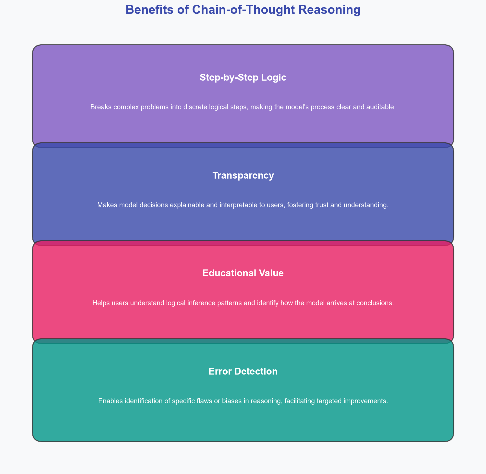

# NLIstral-7B-QLoRA: Interpretable NLI with Augmented Chain-of-Thought Fine-Tuning

## Abstract

This paper details fine-tuning Mistral-7B for Natural Language Inference (NLI) using Chain-of-Thought (CoT) reasoning. We introduce Reflection-CoT, a novel data augmentation mechanism targeting label disagreement by using a stronger model (`open-mistral-nemo`, 12B) to correct initial CoT errors. This approach yields accurate, interpretable NLI classifications. Parameter-efficient QLoRA fine-tuning combined with our multi-stage data pipeline balances performance, efficiency, and transparency.

## Table of Contents
1. [Introduction and Motivation](#introduction-and-motivation)
   - 1.1. [Problem Statement](#problem-statement)
   - 1.2. [Motivation & Background](#motivation-and-background)
   - 1.3. [Overview of Architecture](#overview-of-architecture)
   - 1.4. [Contributions](#contributions)
2. [Methodology](#methodology)
   - 2.1. [Synthetic Data Augmentation: The Reflection-CoT Pipeline](#synthetic-data-augmentation-the-reflection-cot-pipeline)
   - 2.2. [Model Architecture & Fine-Tuning Strategy](#model-architecture--fine-tuning-strategy)
   - 2.3. [Training Environment and Hyperparameters](#training-environment-and-hyperparameters)
3. [Experiment I - Evolution of Data Augmentation Strategy](#experiment-i---evolution-of-data-augmentation-strategy)
   - 3.1. [Initial Experiments: Learning From Failure](#initial-experiments-learning-from-failure)
   - 3.2. [Less-Is-All-You-Need: Improved Thought Generation](#less-is-all-you-need-improved-thought-generation)
   - 3.3. [LLM-As-A-Judge: Iterative Self-Critique & Improvement](#llm-as-a-judge-iterative-self-critique--improvement)
   - 3.4. [Learn-From-Your-Mistakes: The Adopted Self-Reflection & Correction Mechanism](#learn-from-your-mistakes-the-adopted-self-reflection--correction-mechanism)
   - 3.5. [Final Dataset Composition](#final-dataset-composition)
4. [Experiment II - Fine-Tuning with QLoRA](#experiment-ii---fine-tuning-with-qlora)
   - 4.1. [Dockerized Training Environment Details](#dockerized-training-environment-details)
   - 4.2. [Mistral-7B: 4-bit Quantization Details](#mistral-7b-4-bit-quantization-details)
   - 4.3. [Parameter-Efficient Fine-Tuning with QLoRA: Setup](#parameter-efficient-fine-tuning-with-qlora-setup)
   - 4.4. [Ablation Studies & Hyper-Parameter Tuning](#ablation-studies--hyper-parameter-tuning)
5. [Results](#results)
   - 5.1. [Baseline Performance](#baseline-performance)
   - 5.2. [Fine-Tuned Model Performance](#fine-tuned-model-performance)
   - 5.3. [Benchmarks (If Applicable)](#benchmarks-if-applicable)
   - 5.4. [Thought Quality Assessment](#thought-quality-assessment)
6. [Discussion](#discussion)
   - 6.1. [Model Bias and Dataset Considerations](#model-bias-and-dataset-considerations)
   - 6.2. [Labeller Bias and Subjectivity in NLI](#labeller-bias-and-subjectivity-in-nli)
   - 6.3. [Trade-Offs, Assumptions, and Efficiency](#trade-offs-assumptions-and-efficiency)
7. [Limitations and Future Work](#limitations-and-future-work)
   - 7.1. [Current Limitations of Study](#current-limitations-of-study)
   - 7.2. [Proposed Future Work](#proposed-future-work)
      - 7.2.1. [Advanced Reasoning Paradigms (Self-Consistency, Tree-of-Thought)](#advanced-reasoning-paradigms-self-consistency-tree-of-thought)
      - 7.2.2. [RLHF Optimization for Reasoning](#rlhf-optimization-for-reasoning)
      - 7.2.3. [Refining Scoring and LLM-as-a-Judge](#refining-scoring-and-llm-as-a-judge)
      - 7.2.4. [Exploring Full Fine-Tuning](#exploring-full-fine-tuning)
8. [Conclusion](#conclusion)
9. [References](#references)

## Introduction and Motivation

Natural Language Inference (NLI) tests a model's ability to reason about textual relationships. While large language models (LLMs) achieve high NLI accuracy, their decision processes often lack transparency, limiting trust and debuggability. This work addresses this by fine-tuning Mistral-7B to generate interpretable Chain-of-Thought (CoT) reasoning alongside NLI classifications.

### Problem Statement
NLI determines if a "hypothesis" is logically inferable from a "premise." This binary classification (entailment/no-entailment) is challenged by linguistic ambiguity, the need for world knowledge, and complex reasoning. Generating explanatory CoT addresses the opacity of standard NLI models.

### Motivation & Background
CoT prompting, by eliciting step-by-step reasoning, enhances model interpretability and performance on complex tasks like NLI. It allows for error analysis and can mitigate logical fallacies. Mistral-7B was selected for its strong reasoning capabilities within its parameter class and API accessibility (`open-mistral-7b` for initial CoT, `open-mistral-nemo` for reflection), crucial for our data generation strategy.

#### Transformer Architectures for NLI
NLI has often utilized encoder-based (e.g., BERT) or encoder-decoder architectures (e.g., T5), typically encoding premise and hypothesis jointly for direct classification. These models excel at classification but do not natively generate explanatory text.

Our use of a decoder-only autoregressive model (Mistral-7B) for CoT-based NLI is justified by its ability to: (1) unify reasoning and classification in a single generative process; (2) produce flexible, structured outputs (e.g., JSON with CoT and label); (3) leverage pre-trained reasoning capabilities; and (4) integrate world knowledge via autoregressive generation. The causal attention mechanism, mathematically $\text{Attention}(Q, K, V) = \text{softmax}\left(\frac{QK^T}{\sqrt{d_k}} + M\right)V$ (where $M$ is the causal mask), is fundamental to CoT, enforcing step-by-step reasoning.

### Overview of Architecture
Our system integrates a multi-stage data augmentation pipeline with parameter-efficient fine-tuning:

1.  **Multi-Stage Data Augmentation (The Reflection-CoT Pipeline):**
    *   **Stage 1: Initial CoT Generation:** All premise-hypothesis pairs are processed by `open-mistral-7b` to generate an initial CoT and predicted label. This captures the baseline reasoning tendencies of a Mistral-7B class model.
    *   **Stage 2: Error Identification & Reflection Trigger:** Examples where the initial prediction from Stage 1 mismatches the dataset's ground-truth label are flagged (approx. 30% of cases).
    *   **Stage 3: Reflection-CoT Generation:** For flagged examples, the `open-mistral-nemo` (12B parameter) model is employed. It receives the premise, hypothesis, the *true label*, and the *original flawed CoT from `open-mistral-7b`*. Its task is to analyze the prior error and generate a corrected CoT that leads to the true label. The use of a more powerful 12B model for reflection is crucial, as this meta-reasoning task (analyzing and correcting another model's complex reasoning) requires greater capacity than the initial CoT generation. This specific contextual input guides `open-mistral-nemo` to produce targeted corrections rather than entirely new, potentially unrelated reasoning paths.
    *   **Stage 4: Final Dataset Assembly:** The fine-tuning dataset is composed of (a) examples correctly processed in Stage 1, and (b) examples corrected through the Reflection-CoT mechanism in Stage 3. This ensures comprehensive coverage and high-quality reasoning paths for all original examples.

2.  **Parameter-Efficient Fine-Tuning (PEFT):**
    *   The augmented dataset, rich with CoT examples, is used to fine-tune `mistralai/Mistral-7B-v0.3` using QLoRA. This method involves 4-bit quantization of the base model and training low-rank adapters, enabling efficient tuning on accessible hardware (e.g., single 24GB GPU) by updating only a small fraction of parameters.
    *   Key training aspects include optimized sequence length (512 tokens based on CoT analysis), batching, and learning rate schedules.

### Contributions

Our primary contributions are:

1. The **Reflection-CoT** mechanism: A novel data augmentation approach that addresses label disagreement by providing models with both the correct label and flawed reasoning, enabling targeted correction of logical errors.

2. An empirical analysis of **CoT brevity and effectiveness**: Demonstrating that concise reasoning (150-350 tokens) correlates with higher accuracy for NLI tasks, informing both our prompt engineering and training optimizations.

3. A comprehensive case study of **QLoRA fine-tuning for reasoning tasks**: Providing practical insights into hyperparameter selection and training stability for parameter-efficient fine-tuning of reasoning-focused language models.

## Methodology

This section details the technical implementation of our data generation and model fine-tuning processes.

### 2.1. Synthetic Data Augmentation: The Reflection-CoT Pipeline

The core of our NLI fine-tuning data was synthetically generated CoT examples. This section details our proposed **Reflection-CoT** data augmentation pipeline.

#### Initial Thought Generation

For the first stage of our pipeline, we used `open-mistral-7b` to generate CoT reasoning and predicted labels for all premise-hypothesis pairs in our dataset. The model was prompted to:

1. Analyze the premise and hypothesis carefully
2. Generate step-by-step reasoning (encouraged to be brief, typically 3 steps)
3. Provide a final binary label (0 for no-entailment, 1 for entailment)
4. Format the output as JSON: `{"thought_process": "...", "predicted_label": 0|1}`

This process yielded an initial set of CoT examples, approximately 65-70% of which matched the dataset's gold standard labels. We chose Mistral-7B for this stage based on empirical observations that its concise reasoning patterns often aligned better with the dataset's binary labels compared to larger models that sometimes "overthought" examples, particularly for subjective cases.

The choice to capture the base model's "natural" reasoning before any correction was deliberate—it provided a baseline understanding of the model's approach and would potentially minimize friction between the base model and the fine-tuned LoRA adapter by preserving reasoning patterns the model was already comfortable with.

#### Chain-of-Thought as Pre-Label Alignment

A key insight in our approach is viewing Chain-of-Thought as a form of "pre-label alignment"—a process that guides the model's internal representations toward the correct classification before it produces a label. This differs from traditional fine-tuning, where the model is directly optimized for label accuracy without explicit reasoning.

By training the model to generate reasoning paths that lead to specific labels, we:

1. **Constrain the solution space**: The model must follow a logical path to the label rather than learning arbitrary correlations
2. **Enable verification**: Each step in the reasoning can be verified independently
3. **Facilitate human intervention**: Points of disagreement can be precisely identified within the reasoning chain

This pre-label alignment is particularly valuable in cases where label subjectivity might otherwise lead to confusion or inconsistency in the model's learning process.

#### Reflection on Errors: The Reflection-CoT Mechanism

A core component of our methodology is the **Reflection-CoT mechanism**, designed to address instances where the initial CoT generation by `open-mistral-7b` yielded predictions inconsistent with the provided dataset labels (approximately 30% of cases, as noted in experiment logs, `BLOG.md`).

**Addressing Label Disagreement & Limitations of Automated Correction:** Initial explorations (detailed in experiment logs, `BLOG.md`) into resolving these disagreements by attempting to automatically guide the model towards the correct label without explicit instruction (i.e., "correct naturally" through iterative self-scoring with stronger models) proved both prohibitively expensive (estimated >£100 in API costs for a subset) and largely ineffective. Models often struggled to find coherent, natural reasoning paths to the target label, reinforcing concerns about dataset label subjectivity and the limitations of purely automated refinement in such scenarios.

**Mechanism Design:** Consequently, the Reflection-CoT mechanism employs a more direct approach. For premise-hypothesis pairs where `open-mistral-7b`'s prediction was incorrect, a stronger model, `open-mistral-nemo` (a 12B parameter model), was utilized. The `open-mistral-nemo` model was provided with:
1.  The original premise and hypothesis.
2.  The **true label** from the dataset (acknowledging it as the "gold standard" for the task).
3.  The **original, flawed thought process** generated by `open-mistral-7b`.
The model was then explicitly prompted to analyze the initial mistake and generate a corrected reasoning path that logically leads to the true label.

**Rationale for Stronger Model & Contextual Input:** `open-mistral-nemo` (12B) was chosen over the initial 7B model for reflection due to its enhanced reasoning capabilities, deemed necessary for the complex meta-reasoning task of identifying logical flaws in another model's output and constructing a sound, corrective argument. Providing the original flawed reasoning as context was a deliberate design choice aimed at:
*   Guiding `open-mistral-nemo` to correct the *specific logical failure* rather than merely generating any valid path to the true label.
*   Addressing the potential for the reflection model to produce forced or unnatural reasoning if only given the target label, especially given the observed subjectivity of some dataset labels.
*   Encouraging the reflection model to potentially emulate the concise style of the initial CoT, having seen an example (albeit flawed).
This process was crucial for systematically handling challenging examples and creating a more robust training set by learning from initial model failures.

#### Prompt Engineering

Significant effort was invested in prompt design for both generation and reflection:
*   **Structure:** Utilized Markdown and XML tags for clarity.
*   **Output Format:** Enforced JSON output (`{"thought_process": "...", "predicted_label": ...}`) using few-shot examples in the prompt.
*   **CoT Guidance:** Instructions for step-by-step reasoning, refined to encourage brevity and a 3-step structure, which correlated with higher accuracy and efficiency. (Per experiment logs, `BLOG.md`, this refinement itself improved initial CoT accuracy from ~65% to ~70-75% - *TODO: Confirm/update placeholder numbers if possible*).
*   **Reflection Prompt:** Specifically asked the model to analyze the prior (incorrect) thought process and generate a corrected one.

#### Final Dataset Composition and Characteristics

The fine-tuning dataset was constructed by:
*   Including examples where the initial `open-mistral-7b` generation was correct.
*   Including examples where the initial generation was incorrect but were subsequently corrected through the reflection process with `open-mistral-nemo` (12B).
This strategy aimed to leverage the strengths of both models and ensure the fine-tuning dataset covered the full range of original NLI examples with the best available reasoning for each.

### 2.2. Model Architecture & Fine-Tuning Strategy

#### Base Model: Mistral-7B

The base model for fine-tuning was `mistralai/Mistral-7B-v0.3`.

**Rationale:** Chosen for its strong performance-to-cost ratio, good reasoning capabilities within its size class, fast inference speed, and the availability of an API ecosystem that facilitated the multi-stage data generation process.

#### Parameter-Efficient Fine-Tuning (PEFT) with QLoRA

QLoRA was employed for fine-tuning to manage memory constraints.

**Quantization:** The base Mistral-7B model weights were loaded in 4-bit precision using NF4 ("NormalFloat 4") via `bitsandbytes`. Double quantization was used for further memory savings. Mathematically, for a weight tensor $W$, NF4 quantization $W_q$ can be expressed as: $W_q = \text{round}\left(\frac{W - \mu}{\sigma} \cdot s\right) \cdot \frac{\sigma}{s} + \mu$, where $\mu, \sigma$ are mean/std.dev and $s$ is a scaling factor.

**LoRA (Low-Rank Adaptation):** Small, trainable adapter matrices ($B \in \mathbb{R}^{m \times r}, A \in \mathbb{R}^{r \times n}$) were injected into the attention mechanism's linear layers (`q_proj`, `k_proj`, `v_proj`, `o_proj`) of the frozen, quantized base model. The weight update is $\Delta W = BA$. The effective weights become $W' = W + \alpha \cdot BA$. Only $A$ and $B$ are trained.

**Key QLoRA Parameters:**
*   `lora_r` (rank): Typically 16 or 32 in experiments.
*   `lora_alpha` (scaling): Typically `2 * r`.
*   `lora_dropout`: e.g., 0.05.

**[TODO: Insert diagram of QLoRA architecture showing the original weight matrix, the low-rank decomposition, and how they combine during inference]**

### 2.3. Training Environment and Hyperparameters

#### Environment and Configuration

To ensure consistency and reproducibility across different hardware environments, we developed a Dockerized training environment. This approach was crucial given the complex dependencies between specific versions of CUDA, PyTorch, and various libraries like PEFT, TRL, and bitsandbytes.

**[TODO: Add details about the Docker setup, base image, key dependencies]**

#### Key Hyperparameters and Optimizations

*   **Epochs:** Typically 2-5, with early stopping based on validation loss.
*   **Batch Size:** Effective batch sizes varied (e.g., 16, 32, 64) using `per_device_train_batch_size` and `gradient_accumulation_steps`.
*   **Learning Rate:** e.g., `2e-4` or `5e-5`, with a cosine learning rate scheduler and warmup.
    *   **Warmup Strategy:** Fixed `warmup_steps` (e.g., 50-150, as noted in experiment logs, `BLOG.md`) were preferred over `warmup_ratio`. This decision was based on observed instabilities when `warmup_ratio` interacted with varying total training steps (due to changes in epochs or batch sizes) and challenges in correctly restoring learning rate scheduler states upon resumption of training, which could lead to inappropriate learning rate spikes (`BLOG.md`). Fixed steps provided more predictable and reproducible control over the initial learning phase.
*TODO: Be specific about how early stopping was implemented if used. For LR, provide justification if choices were based on preliminary experiments or standard practices.*
*   **Optimizer:** `paged_adamw_8bit` was used for memory efficiency.
*   **Sequence Length Optimization:** `max_seq_length` was set to 512 tokens. This decision was a crucial post-analysis optimization (experiment logs, `BLOG.md`). After generating the full CoT dataset using brevity-focused prompts, analysis confirmed that no generated example exceeded 400 tokens. Setting `max_seq_length=512` thus safely accommodated all generated CoTs while dramatically reducing computational load (due to quadratic scaling of attention) and GPU VRAM requirements. This optimization was instrumental in enabling the exploration of other hyperparameters (e.g., larger batch sizes, higher LoRA ranks) and achieved a "double win": improved potential accuracy through concise reasoning and significant efficiency gains.
*TODO: If the analysis notebook correlating length/accuracy is found or can be reproduced, cite it or summarize key findings more concretely here. Mention the ~3x inference speedup if attributable and quantifiable.*
*   **BF16 Handling:** An `autocast` wrapper around the model's forward pass was used to mitigate dtype mismatches when using `bfloat16` precision with gradient checkpointing.
*   **Gradient Checkpointing:** Enabled in most configurations to save memory by recomputing activations during the backward pass.
*TODO: Explain *why* these optimizations (BF16 handling, gradient checkpointing) were necessary or beneficial in the context of the hardware used or model size.*

## 3. Experiment I - Evolution of Data Augmentation Strategy

This section details our iterative journey to develop an effective data augmentation strategy for NLI Chain-of-Thought fine-tuning.

### Initial Experiments: Learning From Failure

Our first approach to fine-tuning was naive in several ways. We used a pre-quantized GPTQ version of Mistral-7B with poorly configured hyperparameters and an overly simplistic dataset. This initial dataset suffered from multiple limitations:

1. **Limited Coverage:** We only used examples where `open-mistral-7b` predictions already matched the dataset labels (approximately 65-70% of examples), discarding challenging cases.

2. **Data Reduction:** After further filtering to balance label distribution, we trained on only about 10,000 examples.

3. **Confirmation Bias:** By only including examples the model already handled correctly, we reinforced existing patterns without addressing blind spots.

The result was predictable: the model overfit extremely quickly, often within a single epoch, and failed to generalize to more challenging examples. This experience highlighted the critical importance of data quality and diversity in CoT fine-tuning. We needed a more sophisticated data generation approach that could handle the full spectrum of examples, including those where the model initially disagreed with dataset labels.

### Less-Is-All-You-Need: Improved Thought Generation

After our initial failure, we conducted a thorough analysis of the generated thought chains to understand patterns in high-performing versus low-performing examples. This analysis revealed a striking pattern: the length of the reasoning chain strongly correlated with accuracy.

Specifically, we found:
- Thought chains between 150-350 tokens showed the highest accuracy
- Examples with 350-500 tokens still performed well
- Performance degraded linearly as token count increased beyond 750-1000 tokens
- Very short examples (0-100 tokens) also performed poorly

This finding suggested an important insight: concise, focused reasoning was more likely to arrive at the correct label according to the dataset. Manual inspection confirmed this pattern, revealing that shorter chains were typically "concise, simplistic, logical," while longer ones often exhibited "overthinking" and struggled with examples that had subjective elements.

Based on this analysis, we redesigned our prompts to explicitly encourage brevity and structure (typically a 3-step reasoning process). This simple change had a remarkable impact, improving the initial generation accuracy from around 65% to 70-75% without changing the underlying model. This insight would later inform our choice of `max_seq_length=512` for fine-tuning, creating a "double win" of better accuracy and improved efficiency.

### LLM-As-A-Judge: Iterative Self-Critique & Improvement

With improved thought generation in place, we still needed to address the approximately 30% of examples where our generated thoughts disagreed with dataset labels. Rather than simply discarding these examples, we explored an automated approach to improve them.

We developed an LLM-as-a-judge system (implemented in `scripts/score_thoughts.py`) that would:
1. Score the quality of a generated thought process based on criteria such as coherence, correctness, and alignment with the label
2. For examples scoring below a threshold, attempt to improve the reasoning through iterative refinement
3. Recursively apply this process, potentially escalating to stronger models when necessary

This approach revealed a significant challenge: in our dataset, there was a stark precision-recall imbalance (approximately 90% precision but only 50% recall). This suggested either model bias, labeler bias, or both—many "no-entailment" examples in the dataset appeared to be entailed according to both the model's reasoning and our manual verification.

While promising in concept, this self-improvement approach proved prohibitively expensive (costing >£100 for a subset of examples) and often failed to converge on subjective examples. Despite numerous iterations and model upgrades, some premise-hypothesis pairs simply wouldn't yield a satisfactory agreement with the dataset label.

### Learn-From-Your-Mistakes: The Adopted Self-Reflection & Correction Mechanism

After consulting with university advisors, we confirmed that despite apparent subjectivity in some cases, the dataset should be treated as the "gold standard" for this task. This guidance led to our final and most successful data augmentation approach: the Reflection-CoT mechanism.

Rather than trying to coax models into naturally arriving at potentially counterintuitive labels or discarding challenging examples, we embraced a more direct approach:

1. For examples where the initial prediction was incorrect, we provided a stronger model (`open-mistral-nemo`, a 12B parameter model) with:
   - The original premise and hypothesis
   - The true label from the dataset 
   - The original, flawed thought process

2. We explicitly prompted `open-mistral-nemo` (12B) to:
   - Analyze why the initial reasoning led to an incorrect conclusion
   - Identify the specific logical flaws or oversights
   - Generate a corrected reasoning path that logically leads to the true label

This approach was superior to simply asking a model to generate reasoning for a given label from scratch because:
- It specifically addressed the flaws in the original reasoning rather than generating any arbitrary path to the label
- It preserved the style and approach of the original CoT while fixing only what was necessary
- It created more natural, grounded corrections than might emerge from forcing a model to justify a label it disagreed with
- It avoided potential hallucination that might occur when a model was asked to support a conclusion that seemed counterintuitive to it

Manual inspection of a random sample of these reflections confirmed they effectively identified and corrected flaws in the original reasoning while maintaining consistency in style and approach.

### Final Dataset Composition

Our final fine-tuning dataset combined:
1. Examples where the initial `open-mistral-7b` generation produced the correct label and reasoning
2. Examples where the initial generation was incorrect but were corrected through our Reflection-CoT process (using `open-mistral-nemo`, 12B)

This approach effectively doubled our usable training data compared to our initial naive approach, improved class balance, and ensured coverage of the full spectrum of examples, including challenging edge cases.

## 4. Experiment II - Fine-Tuning with QLoRA

After developing our data augmentation pipeline, we turned to the technical challenges of fine-tuning Mistral-7B on this data efficiently.

### Dockerized Training Environment Details

To ensure consistency and reproducibility across different hardware environments, we developed a Dockerized training environment. This approach was crucial given the complex dependencies between specific versions of CUDA, PyTorch, and various libraries like PEFT, TRL, and bitsandbytes.

### Mistral-7B: 4-bit Quantization Details

Full fine-tuning of a 7B parameter model requires substantial GPU memory and computational resources. To make this process more accessible, we employed 4-bit quantization via the bitsandbytes library:

1. **NF4 Data Type:** The "NormalFloat 4" format provides a good balance between compression and representational capacity.
2. **Double Quantization:** For further memory reduction, we quantized both the weights and the quantization constants themselves.
3. **BFloat16 Computation:** While weights were stored in 4-bit precision, actual forward/backward computations used BFloat16 for stability.

This quantization strategy reduced the memory footprint by approximately 75% compared to FP16 training, making it possible to fine-tune on consumer GPUs with 24GB of VRAM.

### Parameter-Efficient Fine-Tuning with QLoRA: Setup

Building on the quantized model, we implemented Low-Rank Adaptation (LoRA) to further increase parameter efficiency:

1. **Target Modules:** We applied LoRA to the query, key, value, and output projection matrices in the attention mechanism (`q_proj`, `k_proj`, `v_proj`, `o_proj`).
2. **Rank and Alpha:** We experimented with different rank values (typically `r=16` or `r=32`) and scaling factors (`lora_alpha=32` or `lora_alpha=64`), finding that higher ranks were beneficial for capturing the complexity introduced by our reflection data.
3. **Dropout:** A small dropout value (`lora_dropout=0.05`) was applied for regularization.

This QLoRA approach allowed us to fine-tune the model while updating only 0.1-0.2% of the parameters, dramatically reducing computational requirements while maintaining performance.

#### Mathematical Formulation of QLoRA

QLoRA combines 4-bit quantization with Low-Rank Adaptation. Here we provide the mathematical foundations for both components.

**4-bit Quantization (NF4):**

The NormalFloat 4-bit (NF4) quantization maps 16-bit or 32-bit floating-point weights to a 4-bit representation following a normal distribution. For each weight tensor $W \in \mathbb{R}^{m \times n}$, the quantization process can be expressed as:

$$W_q = \text{round}\left(\frac{W - \mu}{\sigma} \cdot s\right) \cdot \frac{\sigma}{s} + \mu$$

Where:
- $W_q$ is the quantized weight tensor
- $\mu$ is the mean of the weight values
- $\sigma$ is the standard deviation of the weight values
- $s$ is a scaling factor determined by the NF4 quantization scheme
- $\text{round}(\cdot)$ maps to the nearest 4-bit representable value

For double quantization, the quantization constants themselves are further quantized to 8 bits, reducing memory requirements further.

**Low-Rank Adaptation (LoRA):**

In standard fine-tuning, we would update the full weight matrices $W$ of the model. With LoRA, for each weight matrix $W \in \mathbb{R}^{m \times n}$ that we want to adapt, we instead introduce a low-rank decomposition:

$$\Delta W = BA$$

Where:
- $B \in \mathbb{R}^{m \times r}$ and $A \in \mathbb{R}^{r \times n}$ are the LoRA adaptation matrices
- $r$ is the rank hyperparameter ($r \ll \min(m, n)$)

During forward propagation, instead of using the original weights $W$, we use:

$$W' = W + \alpha \cdot \Delta W = W + \alpha \cdot BA$$

Where:
- $\alpha$ is a scaling factor (typically set to $\alpha = 2 \cdot r$)
- The original weights $W$ remain frozen (and quantized in QLoRA)
- Only $A$ and $B$ are updated during training

This approach dramatically reduces the number of trainable parameters from $m \times n$ to $r \times (m + n)$, which is especially significant for large matrices in transformer models.

**[TODO: Insert diagram of QLoRA architecture showing the original weight matrix, the low-rank decomposition, and how they combine during inference]**

### Ablation Studies & Hyper-Parameter Tuning

We conducted several ablation studies to identify optimal training parameters:

1. **Batch Size and Learning Rate:**
   - **Ablation 0 (Small Batch):** Effective batch size 16, `lr=2e-4`, 2 epochs
   - **Ablation 1 (Medium Batch):** Effective batch size 32, `lr=2e-4`, 2 epochs, with gradient checkpointing
   - **Ablation 2 (Large Capacity/Batch):** Effective batch size 64, `lr=5e-5`, 5 epochs, with gradient clipping at 1.0

2. **Sequence Length:** Based on our token analysis, we set `max_seq_length=512`, which safely accommodated all generated CoT examples (maximum observed length <400 tokens) while significantly reducing computation time and memory usage.

3. **Warmup Strategy:** We found that fixed `warmup_steps` (ranging from 50-150) provided better stability than ratio-based warmup, particularly when resuming training or adjusting training duration.

**[TODO: Add table with detailed hyperparameter settings for each ablation]**

## 5. Results

**[TODO: This section will present quantitative and qualitative results from our experiments, including:]**

### Baseline Performance

How Mistral-7B performed on NLI before fine-tuning

### Fine-Tuned Model Performance

Accuracy, precision, recall, and F1 scores across different models

### Benchmarks (If Applicable)

Comparison to other approaches or models if available

### Thought Quality Assessment

Assessment of the quality and interpretability of generated reasoning

## 6. Discussion

### Model Bias and Dataset Considerations

Our experimental process revealed potential biases in both the base models and dataset. The initial `open-mistral-7b` generations demonstrated a tendency to classify borderline cases as "entailment," possibly reflecting training data biases or an inherent reasoning approach that favors finding connections between texts. This bias was particularly evident in the precision-recall imbalance we observed, with models achieving approximately 90% precision but only 50% recall on the dataset.

### Labeller Bias and Subjectivity in NLI

Manual verification of examples where model predictions disagreed with dataset labels revealed a significant finding: many "no-entailment" examples in the dataset appeared to be reasonably classified as "entailment" based on logical analysis. This observation suggests potential labeler bias or inconsistency in the original dataset annotation process. The subjective nature of NLI became increasingly apparent as our models struggled to naturally arrive at the dataset-assigned label for certain examples, despite multiple iterations and reasoning approaches. After consultation with university advisors, we adopted the position that despite these apparent inconsistencies, the dataset labels should be treated as the "gold standard" for the task, informing our development of the Reflection-CoT mechanism.

### Trade-Offs, Assumptions, and Efficiency

Our approach balanced several competing objectives:

1. **Accuracy vs. Interpretability:** While black-box classification might achieve marginally higher accuracy, our CoT approach prioritized interpretability, allowing for error analysis and verification of reasoning steps.

2. **Dataset Assumption:** We operated under the assumption that dataset labels represent ground truth, even when subjectively questionable. This assumption was necessary for standardization but required our Reflection-CoT mechanism to bridge disagreements.

3. **Efficiency vs. Coverage:** Our optimization of sequence length (512 tokens) and identification of the optimal CoT brevity zone (150-350 tokens) created a "double win" - improving both accuracy and efficiency simultaneously. This insight enabled us to explore a broader hyperparameter space despite computational constraints.

4. **Model Size vs. Task Complexity:** Using a larger model (`open-mistral-nemo`, 12B) for reflection while fine-tuning a smaller model (Mistral-7B) represents a pragmatic compromise between leveraging the reasoning capabilities of larger models while maintaining deployment efficiency.

### Broader Implications and Methodological Reflections

The bias patterns observed in this study have significant implications for NLI research and applications. The precision-recall imbalance (90% precision, 50% recall) suggests systematic disagreement between human annotators and model reasoning that extends beyond simple model error. Such disagreement raises important questions about the epistemological foundations of NLI tasks—what constitutes valid "entailment" may vary based on interpretation depth, background knowledge assumptions, and reasoning strategies.

Our Reflection-CoT mechanism represents a pragmatic approach to handling such bias: rather than discarding problematic examples or forcing models to learn potentially inconsistent patterns, we created a transparent reasoning bridge between the model's natural inference tendencies and the dataset's established ground truth. This approach acknowledges bias while providing a structured mechanism to address it.

For researchers interpreting our results or implementing similar systems, we recommend:

1. **Explicit Bias Documentation:** Maintain transparency about observed dataset biases and how they were addressed, rather than simply reporting accuracy metrics.

2. **Mixed Evaluation Approaches:** Consider evaluating NLI systems both on traditional accuracy metrics and on reasoning quality metrics that may better capture model capabilities.

3. **Cautious Deployment:** In real-world applications, systems should be deployed with appropriate guardrails, particularly for subjective edge cases where even human annotators might disagree.

These findings suggest that future NLI research might benefit from datasets with multiple valid reasoning paths to the same label, or from multi-annotator approaches that capture reasoning diversity rather than enforcing potentially arbitrary consensus.

## 7. Limitations and Future Work

>*Basically time and resources to explore more questions and refining each part of the process more meticulously. i.e thought generation could be further standardised and validated, more hyper-parameter tuning and exploration of a wider family of ablations in training. More thorough results analysis such as performance with vs without chain-of-thought etc. Potentially also digging into the generated thought chains and determinig their quality.*

### Current Limitations of Study

### Proposed Future Work

#### Advanced Reasoning Paradigms (Self-Consistency, Tree-of-Thought)

#### RLHF Optimization for Reasoning

#### Refining Scoring and LLM-as-a-Judge

#### Exploring Full Fine-Tuning

## 8. Conclusion

## 9. References

**[TODO: Add references to relevant papers and resources. Add a note about reproducibility: "Code and the Reflection-CoT augmented dataset are available at [GitHub/Hugging Face Link]."]**

(Remaining sections to be completed in future updates. For practical implementation details, please refer to the corresponding documentation files: [DATA.md](DATA.md), [TRAINING.md](TRAINING.md), and [EVALUATION.md](EVALUATION.md))