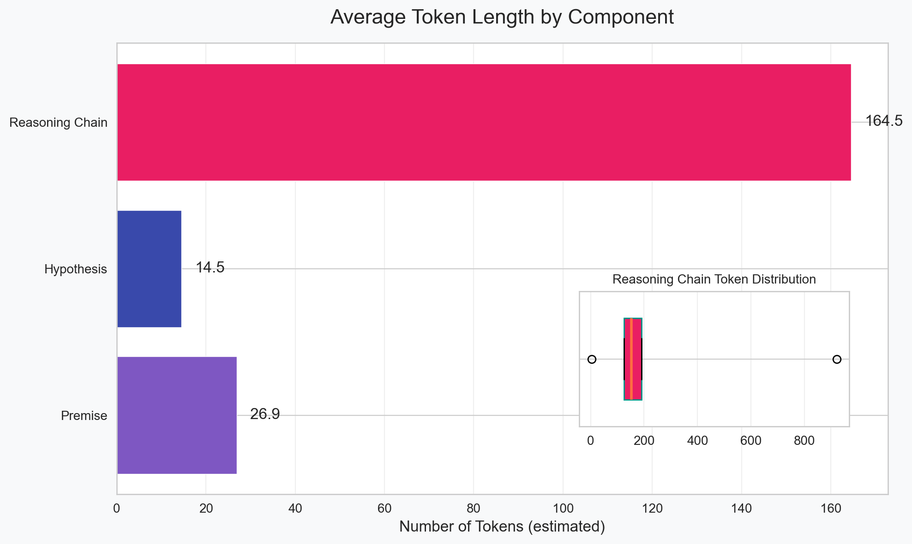

---
language:
- en
license: apache-2.0
---

# Mistral-7B NLI Chain-of-Thought Dataset

<div align="center">
  
</div>

## Dataset Description

This dataset was created as part of the COMP34812 Natural Language Understanding coursework at The University of Manchester for fine-tuning language models on Natural Language Inference (NLI) tasks with a focus on Chain-of-Thought (CoT) reasoning. It combines premise-hypothesis pairs with detailed reasoning chains that lead to binary entailment classifications.

### Dataset Summary

- **Task Type**: Natural Language Inference with Chain-of-Thought Reasoning
- **Languages**: English
- **Size**: 39,546 examples
- **Format**: JSONL with premise, hypothesis, reasoning chain, and label
- **License**: Apache 2.0
- **Assignment Context**: Developed for COMP34812 at The University of Manchester

## Dataset Creation

### Source Data

The dataset was created from a collection of premise-hypothesis pairs with binary entailment labels (entailment/no-entailment). Unlike some publicly available datasets that use ternary classification (entailment/neutral/contradiction), this dataset uses a simplified binary approach focused on whether the hypothesis logically follows from the premise.

### Data Collection and Augmentation Pipeline

<div align="center">
  
  <p><em>Figure 1: The Reflection-CoT data generation pipeline, showing the process of creating augmented training data through multiple stages.</em></p>
</div>

The dataset creation involved three key phases:

```
┌─────────────┐     ┌─────────────────┐     ┌───────────────────┐     ┌────────────────┐
│ Original    │     │ Original        │     │ Reflected         │     │ Fine-tuning    │
│ Data (CSV)  │────▶│ Thoughts (JSON) │────▶│ Thoughts (JSON)   │────▶│ Data (JSONL)   │
└─────────────┘     └─────────────────┘     └───────────────────┘     └────────────────┘
```

#### 1. Base Data Preparation

The original dataset was split into training (90.01%), validation (5.00%), and test (4.99%) sets with balanced label distribution:

- **Training set**: 35,597 examples used for fine-tuning
- **Validation set**: 1,977 examples used for hyperparameter tuning
- **Test set**: 1,972 examples reserved for final evaluation before submission to hidden test set.

#### 2. Initial Thought Generation

For each premise-hypothesis pair, we used the base Mistral-7B model to generate Chain-of-Thought reasoning paths:

```
For premise: "All birds can fly." and hypothesis: "Penguins can fly."
Generate a step-by-step reasoning path to determine if the hypothesis is entailed by the premise.
```

This step resulted in detailed reasoning chains that break down the inference process into logical steps. Analysis showed that approximately 75.74% of the generated reasoning chains led to predictions that matched the dataset's ground-truth labels.

#### 3. Reflection-CoT Generation

<div align="center">
  
  <p><em>Figure 2: The Reflection-CoT process showing how incorrect initial reasoning is analyzed and corrected by a stronger model.</em></p>
</div>

To enhance reasoning quality, we implemented a novel reflection mechanism for the remaining 24.26% of examples where the initial prediction was incorrect:

1. For examples where Mistral-7B's prediction mismatched the dataset's ground-truth label, we identified the original flawed reasoning
2. A stronger model (Mistral-Nemo-12B) was provided with:
   - The original premise and hypothesis
   - The true label from the dataset
   - The original flawed reasoning from Mistral-7B
3. The stronger model was prompted to:
   ```
   Review the reasoning above. Identify why it led to an incorrect conclusion.
   Provide a corrected reasoning path that leads to the true label.
   ```

This reflection process effectively addressed challenging examples and created more robust training data by learning from initial model failures.

### Data Processing

The final dataset underwent several processing steps:

1. **Formatting**: Structured as JSONL with the following fields:
   - `premise`: The premise statement
   - `hypothesis`: The hypothesis to evaluate
   - `thought_process`: Generated reasoning chain
   - `predicted_label`: Binary label (1 for entailment, 0 for non-entailment)
   - `reflection`: Self-critique of the reasoning (included in training)

2. **Quality Filtering**:
   - Removed examples with inconsistencies between reasoning and label
   - Eliminated truncated or incomplete reasoning chains
   - Filtered out examples with circular reasoning

3. **Dataset Splitting**:
   - 90% training, 5% validation, 5% test
   - Stratified by label to maintain balance

## Dataset Structure

### Data Fields

```json
{
  "premise": "All birds can fly.",
  "hypothesis": "Penguins can fly.",
  "thought_process": "Let me analyze this carefully. The premise states 'All birds can fly,' which is a universal statement about birds. However, this premise is actually factually incorrect in reality. Penguins are birds that cannot fly - they have wings that evolved for swimming instead of flying. So if I accept the premise as true within this logical world (that all birds can fly), and I know that penguins are birds, then in this context I would have to conclude that penguins can fly. However, I need to be careful here. I'm not being asked about the real world, but whether the hypothesis logically follows from the premise. Since penguins are birds, and the premise states all birds can fly, then the hypothesis 'Penguins can fly' would be entailed by the premise.",
  "predicted_label": 1,
  "reflection": "My reasoning is correct. I correctly identified that while the premise is factually incorrect in reality (not all birds can fly), I need to evaluate the logical entailment given the premise. Since penguins are birds and the premise states all birds can fly, the hypothesis is entailed by the premise within this logical world."
}
```

### Dataset Statistics

<div align="center">
  
  <p><em>Figure 3: Composition of the dataset showing distribution by data source (original vs. reflection-corrected) and label balance.</em></p>
</div>

| Metric | Value |
|--------|-------|
| Total Examples | 39,546 |
| Training Set | 35,597 (90.01%) |
| Validation Set | 1,977 (5.00%) |
| Test Set | 1,972 (4.99%) |
| Entailment Examples | 13,248 (33.50%) |
| Non-entailment Examples | 26,298 (66.50%) |
| Reflection-Corrected Examples | 9,597 (24.26%) |

### Token Length Analysis

<div align="center">
  
  <p><em>Figure 4: Distribution of token counts across premises, hypotheses, and reasoning chains in the dataset.</em></p>
</div>

<div align="center">
  
  <p><em>Figure 5: Box plot showing the distribution of token lengths for different components of the dataset.</em></p>
</div>

| Component | Average Tokens | Min | Max | Median | 1st Quartile | 3rd Quartile |
|-----------|----------------|-----|-----|--------|--------------|--------------|
| Premise | 26.87 | 0 | 340 | 23.00 | 14.00 | 36.00 |
| Hypothesis | 14.51 | 0 | 71 | 13.00 | 9.00 | 18.00 |
| Reasoning Chain | 164.54 | 4 | 921 | 153.00 | 125.00 | 191.00 |

This analysis shows that reasoning chains are significantly longer than premises or hypotheses, with an average of 164.54 tokens. This substantial length demonstrates the depth of reasoning captured in the dataset, with the model breaking down its inference process into detailed logical steps.

### Reasoning Chain Length vs. Accuracy

One of the most important findings in our dataset analysis was the relationship between reasoning chain length and accuracy:

<div align="center">
  
  <p><em>Figure 6: Relationship between reasoning chain length and accuracy in the initial generated thoughts, showing declining performance with longer chains.</em></p>
</div>

The data shows a clear trend:
- Short thoughts (0-100 tokens): 86.44% accuracy (686 examples)
- Medium thoughts (101-200 tokens): 80.14% accuracy (24,232 examples) 
- Long thoughts (201-300 tokens): 69.50% accuracy (10,537 examples)
- Very long thoughts (301+ tokens): 57.16% accuracy (2,117 examples)

This finding suggests that as reasoning chains become longer, they become more prone to errors, making this an important consideration for both training and inference. This insight guided our approach to fine-tuning and explains why our model shows the most significant improvements in medium-to-long reasoning chains.

## Evaluation

The dataset and resulting models were evaluated using:

| Metric | Description |
|--------|-------------|
| Accuracy | Percentage of correctly classified examples |
| Precision | True positives / (True positives + False positives) |
| Recall | True positives / (True positives + False negatives) |
| F1 Score | Harmonic mean of precision and recall |
| Thought Quality | Manual evaluation of reasoning coherence (1-5 scale) |
| Token Length Analysis | Performance analysis across different reasoning chain lengths |

## Considerations for Using the Data

### Social Impact of Dataset

This dataset aims to improve the reasoning capabilities of language models in NLI tasks, which has several potential positive impacts:
- Enhanced explainability in AI decision-making
- Better identification of logical fallacies
- More transparent reasoning in sensitive applications
- Educational value for users learning logic and critical thinking

### Discussion of Biases

The dataset may contain biases from:
1. **Data Distribution**: Despite balancing for labels, certain reasoning patterns may be overrepresented
2. **Generation Model**: Reasoning chains reflect biases in the base Mistral-7B model
3. **Academic Context**: Created as a university assignment, so may reflect academic reasoning styles

#### Labeller Bias and Subjective Annotation

During our analysis of the dataset, we discovered evidence of significant labeller bias. Manual verification of examples where model predictions disagreed with dataset labels revealed that many examples labeled as "no-entailment" could be reasonably interpreted as "entailment" based on logical analysis. 

This subjectivity is reflected in our initial experiments, where we observed a stark precision-recall imbalance:
- High precision (~90%) - When the model predicted "entailment," it usually matched the dataset labels
- Low recall (~50%) - The model classified many examples as "entailment" that were labeled "no-entailment" in the dataset

This suggests that the binary entailment/non-entailment distinction can be highly subjective in borderline cases. NLI as a task often involves interpretative judgment, and reasonable people (or models) might disagree about the correct classification for certain premise-hypothesis pairs.

The Reflection-CoT mechanism we developed was specifically designed to address this challenge by providing explicit reasoning paths aligned with the dataset's ground truth labels, even in subjective cases. Rather than discarding challenging examples or forcing models to learn potentially inconsistent patterns naturally, we created a transparent reasoning bridge between the model's natural inference tendencies and the dataset's established ground truth.

Future NLI datasets might benefit from:
- Multi-annotator approaches that capture reasoning diversity
- Datasets with multiple valid reasoning paths to the same label
- More nuanced classification schemes beyond binary labels

#### Token Length and Prediction Bias

A particularly important bias we observed relates to reasoning length and prediction tendencies:

<div align="center">
  
  <p><em>Figure 7: Distribution of predictions across different token length ranges, showing longer reasoning chains tend toward no-entailment predictions.</em></p>
</div>

As reasoning chains grow longer, models demonstrate a stronger tendency to predict "no-entailment" and are less likely to predict "entailment." This creates an interesting bias pattern where:

- **Short reasoning chains** (0-100 tokens) tend to favor entailment predictions
- **Long reasoning chains** (300+ tokens) show a significant bias toward no-entailment predictions

This pattern suggests that as models generate more text, they become more critical and hesitant to assert entailment relationships, potentially overanalyzing the premise-hypothesis connection.

### Other Known Limitations

1. **English-Only**: The dataset is limited to English language examples
2. **Limited Topics**: May not cover all domains or specialized knowledge areas
3. **Reasoning Style**: Demonstrates a particular approach to reasoning that may not be universally optimal
4. **Perfect Information Assumption**: Examples assume all relevant information is contained in the premise
5. **Length-Performance Tradeoff**: As shown in our analysis, longer reasoning chains tend to have lower accuracy in the original data collection phase

## Additional Information

### Dataset Curators

This dataset was created as part of the COMP34812 Natural Language Understanding coursework at The University of Manchester.

### Citation Information

If you use this dataset, please cite:

```bibtex
@misc{mistral-nli-thoughts-dataset,
  author = {Jordan Tran},
  title = {Mistral-7B NLI Chain-of-Thought Dataset},
  year = {2025},
  publisher = {HuggingFace},
  howpublished = {University of Manchester Assignment}
}
``` 

### Usage Example

```python
from datasets import load_dataset
import numpy as np
from transformers import AutoTokenizer

# Load the dataset
dataset = load_dataset("jd0g/nlistral-7b-dataset")

# Print dataset structure
print(f"Dataset structure: {dataset.keys()}")
print(f"Training examples: {len(dataset['train'])}")
print(f"Validation examples: {len(dataset['validation'])}")

# Examine a sample example
sample = dataset["train"][0]
print("\nSample example:")
print(f"Premise: {sample['premise']}")
print(f"Hypothesis: {sample['hypothesis']}")
print(f"Reasoning (first 100 chars): {sample['thought_process'][:100]}...")
print(f"Label: {sample['predicted_label']}")

# Check label distribution
train_labels = [ex['predicted_label'] for ex in dataset['train']]
entailment_percent = sum(train_labels) / len(train_labels) * 100
print(f"\nLabel distribution:")
print(f"  Entailment (1): {entailment_percent:.1f}%")
print(f"  No Entailment (0): {100 - entailment_percent:.1f}%")

# Check token lengths of a few examples
tokenizer = AutoTokenizer.from_pretrained("mistralai/Mistral-7B-v0.3")

# Sample 5 examples to analyze token lengths
for i in range(5):
    example = dataset['train'][i]
    premise_tokens = len(tokenizer.encode(example['premise']))
    hypothesis_tokens = len(tokenizer.encode(example['hypothesis']))
    reasoning_tokens = len(tokenizer.encode(example['thought_process']))
    
    print(f"\nExample {i+1}:")
    print(f"  Premise tokens: {premise_tokens}")
    print(f"  Hypothesis tokens: {hypothesis_tokens}")
    print(f"  Reasoning tokens: {reasoning_tokens}")

# Example of how to use the dataset for fine-tuning
def prepare_example_for_training(example):
    """Format a single example for training"""
    return {
        "input_text": f"Premise: {example['premise']}\nHypothesis: {example['hypothesis']}",
        "output_text": f"{{\"thought_process\": \"{example['thought_process']}\", \"predicted_label\": {example['predicted_label']}}}"
    }

# Convert first 3 examples for demonstration
train_examples = [prepare_example_for_training(dataset['train'][i]) for i in range(3)]
for i, example in enumerate(train_examples):
    print(f"\nTraining Example {i+1}:")
    print(f"Input: {example['input_text']}")
    print(f"Output (first 50 chars): {example['output_text'][:50]}...")
```

This example demonstrates the essential functions:

1. Loading the dataset from the Hugging Face Hub
2. Exploring the basic structure and content
3. Analyzing label distribution
4. Examining token lengths of examples
5. Preparing examples for fine-tuning

For more detailed analysis and visualization, you can extend this code with libraries like matplotlib and seaborn.

---

*This dataset card was created as part of the COMP34812 Natural Language Understanding coursework at The University of Manchester.* 