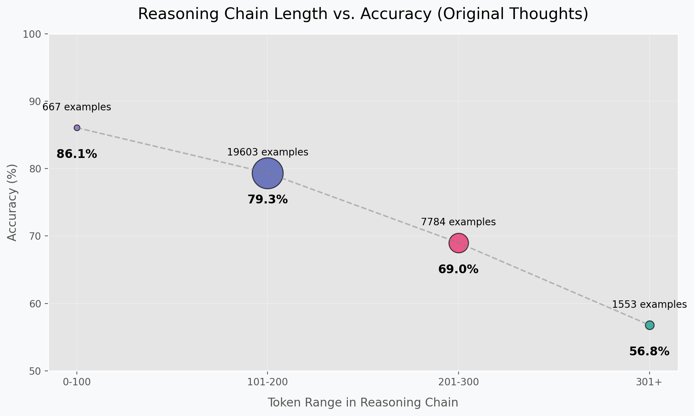

---
language:
- en
license: apache-2.0
---

# Mistral-7B NLI Chain-of-Thought Dataset

<div align="center">
  
</div>

## Dataset Description

This dataset was created as part of a university assignment at The University of Manchester for fine-tuning language models on Natural Language Inference (NLI) tasks with a focus on Chain-of-Thought (CoT) reasoning. It combines premise-hypothesis pairs with detailed reasoning chains that lead to binary entailment classifications.

### Dataset Summary

- **Task Type**: Natural Language Inference with Chain-of-Thought Reasoning
- **Languages**: English
- **Size**: 39,546 examples
- **Format**: JSONL with premise, hypothesis, reasoning chain, and label
- **License**: Apache 2.0
- **Assignment Context**: Developed at The University of Manchester

## Dataset Creation

### Source Data

The dataset was created from a collection of premise-hypothesis pairs with binary entailment labels (entailment/no-entailment). Unlike some publicly available datasets that use ternary classification (entailment/neutral/contradiction), this dataset uses a simplified binary approach focused on whether the hypothesis logically follows from the premise.

### Data Collection and Augmentation Pipeline

<div align="center">
  
</div>

The dataset creation involved three key phases:

```
┌─────────────┐     ┌─────────────────┐     ┌───────────────────┐     ┌────────────────┐
│ Original    │     │ Original        │     │ Reflected         │     │ Fine-tuning    │
│ Data (CSV)  │────▶│ Thoughts (JSON) │────▶│ Thoughts (JSON)   │────▶│ Data (JSONL)   │
└─────────────┘     └─────────────────┘     └───────────────────┘     └────────────────┘
```

#### 1. Base Data Preparation

The original dataset was split into training (90.01%), validation (5.00%), and test (4.99%) sets with balanced label distribution:

- **Training set**: 35,597 examples used for fine-tuning
- **Validation set**: 1,977 examples used for hyperparameter tuning
- **Test set**: 1,972 examples reserved for final evaluation before submission to hidden test set.

#### 2. Thought Generation

For each premise-hypothesis pair, we used the base Mistral-7B model to generate Chain-of-Thought reasoning paths:

```
For premise: "All birds can fly." and hypothesis: "Penguins can fly."
Generate a step-by-step reasoning path to determine if the hypothesis is entailed by the premise.
```

This step resulted in detailed reasoning chains that break down the inference process into logical steps.

#### 3. Reflection Generation

<div align="center">
  
</div>

To enhance reasoning quality, we implemented a novel reflection mechanism:

1. Generated initial thoughts for each example
2. Prompted the model to reflect on those thoughts with:
   ```
   Review the reasoning above. Is there any flaw or oversight in the logic?
   Could the reasoning be improved? Is the conclusion correct?
   ```
3. Refined reasoning chains based on these reflections

Approximately 24.26% of the dataset (9,597 examples) underwent this reflection process, resulting in improved reasoning quality and alignment with the expected labels.

### Data Processing

The final dataset underwent several processing steps:

1. **Formatting**: Structured as JSONL with the following fields:
   - `premise`: The premise statement
   - `hypothesis`: The hypothesis to evaluate
   - `thought_process`: Generated reasoning chain
   - `predicted_label`: Binary label (1 for entailment, 0 for non-entailment)
   - `reflection`: Self-critique of the reasoning (included in training)

2. **Quality Filtering**:
   - Removed examples with inconsistencies between reasoning and label
   - Eliminated truncated or incomplete reasoning chains
   - Filtered out examples with circular reasoning

3. **Dataset Splitting**:
   - 90% training, 5% validation, 5% test
   - Stratified by label to maintain balance

## Dataset Structure

### Data Fields

```json
{
  "premise": "All birds can fly.",
  "hypothesis": "Penguins can fly.",
  "thought_process": "Let me analyze this carefully. The premise states 'All birds can fly,' which is a universal statement about birds. However, this premise is actually factually incorrect in reality. Penguins are birds that cannot fly - they have wings that evolved for swimming instead of flying. So if I accept the premise as true within this logical world (that all birds can fly), and I know that penguins are birds, then in this context I would have to conclude that penguins can fly. However, I need to be careful here. I'm not being asked about the real world, but whether the hypothesis logically follows from the premise. Since penguins are birds, and the premise states all birds can fly, then the hypothesis 'Penguins can fly' would be entailed by the premise.",
  "predicted_label": 1,
  "reflection": "My reasoning is correct. I correctly identified that while the premise is factually incorrect in reality (not all birds can fly), I need to evaluate the logical entailment given the premise. Since penguins are birds and the premise states all birds can fly, the hypothesis is entailed by the premise within this logical world."
}
```

### Dataset Statistics

<div align="center">
  
</div>

| Metric | Value |
|--------|-------|
| Total Examples | 39,546 |
| Training Set | 35,597 (90.01%) |
| Validation Set | 1,977 (5.00%) |
| Test Set | 1,972 (4.99%) |
| Entailment Examples | 13,248 (33.50%) |
| Non-entailment Examples | 26,298 (66.50%) |

### Token Length Analysis

<div align="center">
  
</div>

<div align="center">
  
</div>

| Component | Average Tokens | Min | Max | Median |
|-----------|----------------|-----|-----|--------|
| Premise | 26.87 | 0 | 340 | 23.00 |
| Hypothesis | 14.51 | 0 | 71 | 13.00 |
| Reasoning Chain | 164.54 | 4 | 921 | 153.00 |

This analysis shows that reasoning chains are significantly longer than premises or hypotheses, with an average of 164.54 tokens. This substantial length demonstrates the depth of reasoning captured in the dataset, with the model breaking down its inference process into detailed logical steps.

### Reasoning Chain Length vs. Accuracy

We discovered an interesting relationship between reasoning chain length and accuracy in the original generated thoughts:

<div align="center">
  
</div>

The data shows a clear trend:
- Short thoughts (0-100 tokens): 86.44% accuracy
- Medium thoughts (101-200 tokens): 80.14% accuracy 
- Long thoughts (201-300 tokens): 69.50% accuracy
- Very long thoughts (301+ tokens): 57.16% accuracy

This finding suggests that as reasoning chains become longer, they become more prone to errors, making this an important consideration for both training and inference.

### Evaluation Metrics

The dataset and resulting models are evaluated using:

| Metric | Description |
|--------|-------------|
| Accuracy | Percentage of correctly classified examples |
| Precision | True positives / (True positives + False positives) |
| Recall | True positives / (True positives + False negatives) |
| F1 Score | Harmonic mean of precision and recall |
| Thought Quality | Manual evaluation of reasoning coherence (1-5 scale) |
| Average Token Length | Distribution of token lengths in generated reasoning |

## Dataset Creation Rationale

This dataset was specifically designed as part of a university assignment to address several limitations in existing NLI training:

1. **Transparency**: Standard NLI tasks often lack visibility into model reasoning
2. **Robustness**: Models trained on classification alone may rely on spurious correlations
3. **Error Analysis**: Without reasoning chains, it's difficult to understand model failures
4. **Educational Value**: The assignment aimed to demonstrate how Chain-of-Thought reasoning can improve model performance and explainability

By pairing premise-hypothesis examples with explicit reasoning chains, models trained on this dataset learn to:
- Break down complex inference problems into steps
- Apply logical rules systematically
- Consider multiple perspectives before reaching a conclusion
- Explain their decision-making process to users

<div align="center">
  
</div>

## Considerations for Using the Data

### Social Impact of Dataset

This dataset aims to improve the reasoning capabilities of language models in NLI tasks, which has several potential positive impacts:
- Enhanced explainability in AI decision-making
- Better identification of logical fallacies
- More transparent reasoning in sensitive applications
- Educational value for users learning logic and critical thinking

### Discussion of Biases

The dataset may contain biases from:
1. **Data Distribution**: Despite balancing for labels, certain reasoning patterns may be overrepresented
2. **Generation Model**: Reasoning chains reflect biases in the base Mistral-7B model
3. **Academic Context**: Created as a university assignment, so may reflect academic reasoning styles

#### Token Length and Prediction Bias

A particularly important bias we observed relates to reasoning length and prediction tendencies:

<div align="center">
  
</div>

As reasoning chains grow longer, models demonstrate a stronger tendency to predict "no-entailment" and are less likely to predict "entailment." This creates an interesting bias pattern where:

- **Short reasoning chains** (0-100 tokens) tend to favor entailment predictions
- **Long reasoning chains** (300+ tokens) show a significant bias toward no-entailment predictions

This pattern suggests that as models generate more text, they become more critical and hesitant to assert entailment relationships, potentially overanalyzing the premise-hypothesis connection. Interestingly, this effect appears more pronounced in more capable reasoning models (like DeepSeek and o1), where increased reasoning sophistication can paradoxically lead to worse alignment with some dataset labels due to over-analysis.

Data users should be aware of this relationship when interpreting model outputs, as token length can be a proxy signal for prediction type in untuned models.

### Other Known Limitations

1. **English-Only**: The dataset is limited to English language examples
2. **Limited Topics**: May not cover all domains or specialized knowledge areas
3. **Reasoning Style**: Demonstrates a particular approach to reasoning that may not be universally optimal
4. **Perfect Information Assumption**: Examples assume all relevant information is contained in the premise
5. **Length-Performance Tradeoff**: As shown in our analysis, longer reasoning chains tend to have lower accuracy in the original data collection phase

## Additional Information

### Dataset Curators

This dataset was created as a university assignment at The University of Manchester.

### Citation Information

If you use this dataset, please cite:

```bibtex
@misc{mistral-nli-thoughts-dataset,
  author = {Jordan Tran},
  title = {Mistral-7B NLI Chain-of-Thought Dataset},
  year = {2025},
  publisher = {HuggingFace},
  howpublished = {University of Manchester Assignment}
}
``` 

---

*This dataset card was created as part of an open-ended research project at The University of Manchester.* 