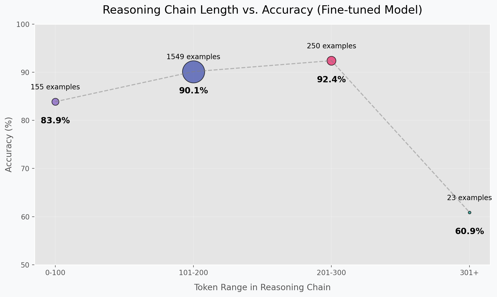

# Mistral-7B Fine-tuned for NLI with Chain-of-Thought Reasoning

<div align="center">
  
  <p><i>Placeholder for model architecture diagram - generated after running metrics script</i></p>
</div>

This repository contains the best fine-tuned versions of `mistralai/Mistral-7B-v0.3` for Natural Language Inference (NLI), specifically trained to generate Chain-of-Thought (CoT) reasoning alongside the classification label (0 for no-entailment, 1 for entailment).

This work was completed as part of a university assignment at The University of Manchester, focusing on improving both classification accuracy and reasoning transparency.

## Model Variants

This repository hosts the best checkpoint from each ablation study, representing different training configurations:

*   **`Ablation0_Best`**: The optimized small batch configuration.
    *   **Configuration Details**:
        * Base model: `mistralai/Mistral-7B-v0.3`
        * Effective batch size: 16 (8 per device × 2 gradient accumulation steps)
        * Learning rate: 2e-4 with cosine scheduler and 3% warmup ratio
        * Training: 2 epochs 
        * LoRA Config: r=16, alpha=32, dropout=0.05
        * Target modules: q_proj, k_proj, v_proj, o_proj
        * Sequence length: 512 tokens
        * 4-bit quantization with NF4 and double quantization

*   **`Ablation1_Best`**: The optimized medium batch configuration.
    *   **Configuration Details**:
        * Base model: `mistralai/Mistral-7B-v0.3`
        * Effective batch size: 32 (16 per device × 2 gradient accumulation steps)
        * Learning rate: 2e-4 with cosine scheduler and 3% warmup ratio
        * LoRA Config: r=16, alpha=32, dropout=0.05
        * Gradient checkpointing enabled for memory efficiency
        * Optimized for performance with tuned warmup ratio

*   **`Ablation2_Best`**: The refined large model configuration.
    *   **Configuration Details**:
        * Base model: `mistralai/Mistral-7B-v0.3`
        * Effective batch size: 64 (16 per device × 4 gradient accumulation steps)
        * Ultra-low learning rate: 5e-5 with cosine scheduler
        * Extended training: 5 epochs
        * Moderate warmup ratio: 5%
        * LoRA Config: r=32, alpha=64, dropout=0.05
        * Stability measures: gradient clipping at 1.0

## Training Methodology

### Data Preparation

The data preparation involved a three-stage process:

<div align="center">
  
  <p><i>Placeholder for data pipeline visualization - generated after running metrics script</i></p>
</div>

1. **Base Data Preparation**: Split into train (90%), validation (5%), and test (5%) sets
2. **Thought Generation**: Generated reasoning chains for each premise-hypothesis pair
3. **Reflection Generation**: Enhanced reasoning via self-critique and reflection

### Training Process

<div align="center">
  
  <p><i>Placeholder for training dynamics visualization - generated after running metrics script</i></p>
</div>

## Configuration Differences

The models represent different training approaches with increasing complexity:

| Parameter | Ablation0_Best | Ablation1_Best | Ablation2_Best |
|-----------|----------------|----------------|----------------|
| Batch Size | 8 per device | 16 per device | 16 per device |
| Gradient Accumulation | 2 steps | 2 steps | 4 steps |
| Effective Batch Size | 16 | 32 | 64 |
| Learning Rate | 2e-4 | 2e-4 | 5e-5 |
| LoRA Rank | 16 | 16 | 32 |
| LoRA Alpha | 32 | 32 | 64 |
| Training Duration | 2 epochs | 2 epochs | 5 epochs |
| Gradient Checkpointing | Disabled | Enabled | Enabled |
| Warmup Ratio | 0.03 | 0.03 | 0.05 |
| Gradient Clipping | None | None | 1.0 |
| Primary Focus | Small batch | Medium batch with optimization | Large model with stability |

## Performance Results

### Classification Performance

<div align="center">
  
  <p><i>Placeholder for model performance comparison - generated after running metrics script</i></p>
</div>

**Metrics on Test Set:**

| Model | Accuracy | Precision | Recall | F1 Score |
|-------|----------|-----------|--------|----------|
| Ablation0_Best | [ACCURACY_0] | [PRECISION_0] | [RECALL_0] | [F1_0] |
| Ablation1_Best | [ACCURACY_1] | [PRECISION_1] | [RECALL_1] | [F1_1] |
| Ablation2_Best | [ACCURACY_2] | [PRECISION_2] | [RECALL_2] | [F1_2] |

### Reasoning Quality Assessment

<div align="center">
  
  <p><i>Placeholder for token length vs accuracy visualization - generated after running metrics script</i></p>
</div>

## Technical Implementation Details

All models use Parameter-Efficient Fine-Tuning (PEFT) with QLoRA:

- **Quantization**: 4-bit with NF4 type and double quantization
- **Optimizer**: paged_adamw_8bit with weight decay 0.01
- **Loss**: Standard autoregressive language modeling loss
- **Scheduler**: Cosine with warmup
- **Target Modules**: Query, Key, Value, and Output projections

This configuration balances efficiency and performance, allowing fine-tuning of the 7B parameter model on consumer hardware while maintaining high quality outputs.

## Loading a Model

You can load any of the models using the `peft` library:

```python
from transformers import AutoModelForCausalLM, AutoTokenizer, BitsAndBytesConfig
from peft import PeftModel

repo_id = "jd0g/Mistral-v0.3-Thinking_NLI"
# Choose the desired model variant
model_variant = "Ablation2_Best"  # Options: "Ablation0_Best", "Ablation1_Best", "Ablation2_Best"

# Load the base model with 4-bit quantization
base_model_name = "mistralai/Mistral-7B-v0.3"
quantization_config = BitsAndBytesConfig(
    load_in_4bit=True,
    bnb_4bit_compute_dtype="bfloat16",
    bnb_4bit_quant_type="nf4",
    bnb_4bit_use_double_quant=True
)
base_model = AutoModelForCausalLM.from_pretrained(
    base_model_name,
    quantization_config=quantization_config,
    device_map="auto"
)

# Load the PeftModel (adapter)
model = PeftModel.from_pretrained(base_model, repo_id, subfolder=model_variant)

# Load the tokenizer
tokenizer = AutoTokenizer.from_pretrained(base_model_name)

# Example inference with proper formatting
premise = "All birds can fly."
hypothesis = "Penguins can fly."
prompt = f"""
Premise: {premise}
Hypothesis: {hypothesis}

Determine if the hypothesis can be inferred from the premise. Write out your thought process step by step, then provide your final answer (1 for entailment, 0 for no entailment). Respond in JSON format with 'thought_process' and 'predicted_label' keys. 
"""

inputs = tokenizer(prompt, return_tensors="pt").to(model.device)
outputs = model.generate(**inputs, max_new_tokens=512, temperature=0.1)
print(tokenizer.decode(outputs[0], skip_special_tokens=True))
```

## Intended Use

These models are designed for NLI tasks where understanding the reasoning process (via CoT) is valuable. The main differences between the variants:

- **Ablation0_Best**: Good overall balance of performance and reasoning with a small batch approach
- **Ablation1_Best**: Enhanced performance with medium batch size and memory optimization
- **Ablation2_Best**: Highest capacity and stability, best for complex reasoning tasks

All models output both detailed reasoning and a final classification label in JSON format.

## Limitations and Ethical Considerations

### Known Limitations

1. **Domain Specificity**: The models are trained on a limited set of NLI examples and may not generalize to all domains
2. **Reasoning Patterns**: The models may develop specific reasoning patterns that don't represent the full spectrum of logical analysis
3. **Context Length**: Fine-tuning used 512 tokens which may limit performance on very long inputs

### Ethical Considerations

1. **Bias**: The models may inherit biases present in the training data
2. **Reasoning Transparency**: While CoT improves explainability, models may still occasionally rationalize incorrect conclusions

---

*This model card was created as part of a university assignment at The University of Manchester. The metrics reported were generated using the `generate_card_metrics.py` script.*