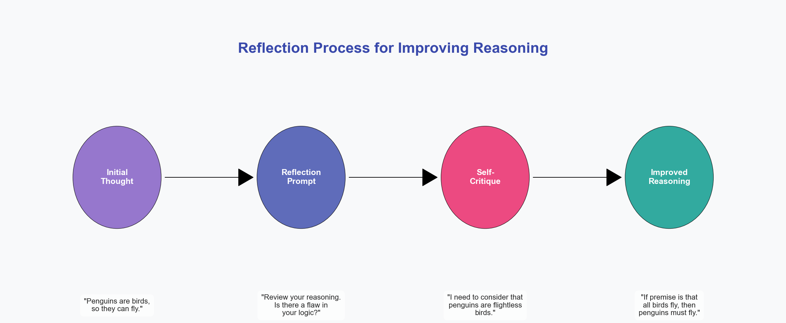
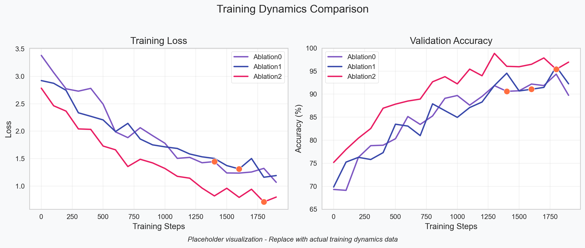
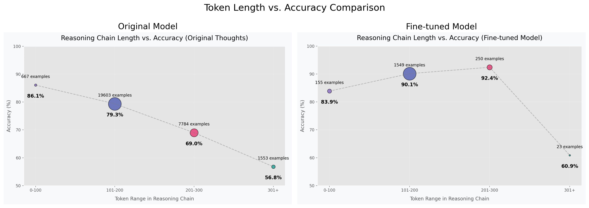

# NLIstral-7B-QLoRA: Interpretable NLI with Augmented Chain-of-Thought Fine-Tuning

## Abstract

This paper details fine-tuning Mistral-7B for Natural Language Inference (NLI) using Chain-of-Thought (CoT) reasoning. We introduce Reflection-CoT, a novel data augmentation mechanism targeting label disagreement by using a stronger model (`open-mistral-nemo`, 12B) to correct initial CoT errors. This approach yields accurate, interpretable NLI classifications. Parameter-efficient QLoRA fine-tuning combined with our multi-stage data pipeline balances performance, efficiency, and transparency.

## Table of Contents
1. [Introduction and Motivation](#introduction-and-motivation)
   - 1.1. [Problem Statement](#problem-statement)
   - 1.2. [Motivation & Background](#motivation-and-background)
   - 1.3. [Overview of Architecture](#overview-of-architecture)
   - 1.4. [Contributions](#contributions)
2. [Methodology](#methodology)
   - 2.1. [Synthetic Data Augmentation: The Reflection-CoT Pipeline](#synthetic-data-augmentation-the-reflection-cot-pipeline)
   - 2.2. [Model Architecture & Fine-Tuning Strategy](#model-architecture--fine-tuning-strategy)
   - 2.3. [Training Environment and Hyperparameters](#training-environment-and-hyperparameters)
3. [Experiment I - Evolution of Data Augmentation Strategy](#experiment-i---evolution-of-data-augmentation-strategy)
   - 3.1. [Initial Experiments: Learning From Failure](#initial-experiments-learning-from-failure)
   - 3.2. [Less-Is-All-You-Need: Improved Thought Generation](#less-is-all-you-need-improved-thought-generation)
   - 3.3. [LLM-As-A-Judge: Iterative Self-Critique & Improvement](#llm-as-a-judge-iterative-self-critique--improvement)
   - 3.4. [Learn-From-Your-Mistakes: The Adopted Self-Reflection & Correction Mechanism](#learn-from-your-mistakes-the-adopted-self-reflection--correction-mechanism)
   - 3.5. [Final Dataset Composition](#final-dataset-composition)
4. [Experiment II - Fine-Tuning with QLoRA](#experiment-ii---fine-tuning-with-qlora)
   - 4.1. [Dockerized Training Environment Details](#dockerized-training-environment-details)
   - 4.2. [Mistral-7B: 4-bit Quantization Details](#mistral-7b-4-bit-quantization-details)
   - 4.3. [Parameter-Efficient Fine-Tuning with QLoRA: Setup](#parameter-efficient-fine-tuning-with-qlora-setup)
   - 4.4. [Ablation Studies & Hyper-Parameter Tuning](#ablation-studies--hyper-parameter-tuning)
5. [Results](#results)
   - 5.1. [Baseline Performance](#baseline-performance)
   - 5.2. [Fine-Tuned Model Performance](#fine-tuned-model-performance)
   - 5.3. [Benchmarks (If Applicable)](#benchmarks-if-applicable)
   - 5.4. [Thought Quality Assessment](#thought-quality-assessment)
   - 5.5. [Results Summary](#results-summary)
6. [Discussion](#discussion)
   - 6.1. [Model Bias and Dataset Considerations](#model-bias-and-dataset-considerations)
   - 6.2. [Labeller Bias and Subjectivity in NLI](#labeller-bias-and-subjectivity-in-nli)
   - 6.3. [Trade-Offs, Assumptions, and Efficiency](#trade-offs-assumptions-and-efficiency)
7. [Limitations and Future Work](#limitations-and-future-work)
   - 7.1. [Current Limitations of Study](#current-limitations-of-study)
   - 7.2. [Proposed Future Work](#proposed-future-work)
      - 7.2.1. [Advanced Reasoning Paradigms (Self-Consistency, Tree-of-Thought)](#advanced-reasoning-paradigms-self-consistency-tree-of-thought)
      - 7.2.2. [RLHF Optimization for Reasoning](#rlhf-optimization-for-reasoning)
      - 7.2.3. [Refining Scoring and LLM-as-a-Judge](#refining-scoring-and-llm-as-a-judge)
      - 7.2.4. [Exploring Full Fine-Tuning](#exploring-full-fine-tuning)
8. [Conclusion](#conclusion)
9. [References](#references)

## Introduction and Motivation

Natural Language Inference (NLI) tests a model's ability to reason about textual relationships. While large language models (LLMs) achieve high NLI accuracy, their decision processes often lack transparency, limiting trust and debuggability. This work addresses this by fine-tuning Mistral-7B to generate interpretable Chain-of-Thought (CoT) reasoning alongside NLI classifications.

### Problem Statement
NLI determines if a "hypothesis" is logically inferable from a "premise." This binary classification (entailment/no-entailment) is challenged by linguistic ambiguity, the need for world knowledge, and complex reasoning. Generating explanatory CoT addresses the opacity of standard NLI models.

### Motivation & Background
CoT prompting, by eliciting step-by-step reasoning, enhances model interpretability and performance on complex tasks like NLI. It allows for error analysis and can mitigate logical fallacies. Mistral-7B was selected for its strong reasoning capabilities within its parameter class and API accessibility (`open-mistral-7b` for initial CoT, `open-mistral-nemo` for reflection), crucial for our data generation strategy.

#### Transformer Architectures for NLI
NLI has often utilized encoder-based (e.g., BERT) or encoder-decoder architectures (e.g., T5), typically encoding premise and hypothesis jointly for direct classification. These models excel at classification but do not natively generate explanatory text.

  
  
<em>Figure: Comparison of encoder-decoder and decoder-only architectures for NLI tasks. While encoder-decoder models excel at classification, decoder-only models like Mistral-7B naturally facilitate step-by-step reasoning generation.</em>

Our use of a decoder-only autoregressive model (Mistral-7B) for CoT-based NLI is justified by its ability to: (1) unify reasoning and classification in a single generative process; (2) produce flexible, structured outputs (e.g., JSON with CoT and label); (3) leverage pre-trained reasoning capabilities; and (4) integrate world knowledge via autoregressive generation. The causal attention mechanism, mathematically $\text{Attention}(Q, K, V) = \text{softmax}\left(\frac{QK^T}{\sqrt{d_k}} + M\right)V$ (where $M$ is the causal mask), is fundamental to CoT, enforcing step-by-step reasoning.

### Overview of Architecture
Our system integrates a multi-stage data augmentation pipeline with parameter-efficient fine-tuning:

1.  **Multi-Stage Data Augmentation (The Reflection-CoT Pipeline):**
    *   **Stage 1: Initial CoT Generation:** All premise-hypothesis pairs are processed by `open-mistral-7b` to generate an initial CoT and predicted label. This captures the baseline reasoning tendencies of a Mistral-7B class model.
    *   **Stage 2: Error Identification & Reflection Trigger:** Examples where the initial prediction from Stage 1 mismatches the dataset's ground-truth label are flagged (approx. 24.32% of cases).
    *   **Stage 3: Reflection-CoT Generation:** For flagged examples, the `open-mistral-nemo` (12B parameter) model is employed. It receives the premise, hypothesis, the *true label*, and the *original flawed CoT from `open-mistral-7b`*. Its task is to analyze the prior error and generate a corrected CoT that leads to the true label. The use of a more powerful 12B model for reflection is crucial, as this meta-reasoning task (analyzing and correcting another model's complex reasoning) requires greater capacity than the initial CoT generation. This specific contextual input guides `open-mistral-nemo` to produce targeted corrections rather than entirely new, potentially unrelated reasoning paths.
    *   **Stage 4: Final Dataset Assembly:** The fine-tuning dataset is composed of (a) examples correctly processed in Stage 1, and (b) examples corrected through the Reflection-CoT mechanism in Stage 3. This ensures comprehensive coverage and high-quality reasoning paths for all original examples.

2.  **Parameter-Efficient Fine-Tuning (PEFT):**
    *   The augmented dataset, rich with CoT examples, is used to fine-tune `mistralai/Mistral-7B-v0.3` using QLoRA. This method involves 4-bit quantization of the base model and training low-rank adapters, enabling efficient tuning on accessible hardware (e.g., single 24GB GPU) by updating only a small fraction of parameters.
    *   Key training aspects include optimized sequence length (512 tokens based on CoT analysis), batching, and learning rate schedules.

  
  
<em>Figure 1: Complete architecture of the NLIstral-7B-QLoRA data generation and fine-tuning pipeline. The process begins with initial CoT generation, followed by error identification, reflection-based correction, and culminates in QLoRA fine-tuning.</em>

### Contributions

Our primary contributions are:

1. The **Reflection-CoT** mechanism: A novel data augmentation approach that addresses label disagreement by providing models with both the correct label and flawed reasoning, enabling targeted correction of logical errors.

2. An empirical analysis of **CoT brevity and effectiveness**: Demonstrating that concise reasoning (150-350 tokens) correlates with higher accuracy for NLI tasks, informing both our prompt engineering and training optimizations.

3. A comprehensive case study of **QLoRA fine-tuning for reasoning tasks**: Providing practical insights into hyperparameter selection and training stability for parameter-efficient fine-tuning of reasoning-focused language models.

## Methodology

This section details the technical implementation of our data generation and model fine-tuning processes.

### 2.1. Synthetic Data Augmentation: The Reflection-CoT Pipeline

The core of our NLI fine-tuning data was synthetically generated CoT examples. This section details our proposed **Reflection-CoT** data augmentation pipeline.

#### Initial Thought Generation

For the first stage of our pipeline, we used `open-mistral-7b` to generate CoT reasoning and predicted labels for all premise-hypothesis pairs in our dataset. The model was prompted to:

1. Analyze the premise and hypothesis carefully
2. Generate step-by-step reasoning (encouraged to be brief, typically 3 steps)
3. Provide a final binary label (0 for no-entailment, 1 for entailment)
4. Format the output as JSON: `{"thought_process": "...", "predicted_label": 0|1}`

This process yielded an initial set of CoT examples, approximately 65-70% of which matched the dataset's gold standard labels. We chose Mistral-7B for this stage based on empirical observations that its concise reasoning patterns often aligned better with the dataset's binary labels compared to larger models that sometimes "overthought" examples, particularly for subjective cases.

The choice to capture the base model's "natural" reasoning before any correction was deliberate—it provided a baseline understanding of the model's approach and would potentially minimize friction between the base model and the fine-tuned LoRA adapter by preserving reasoning patterns the model was already comfortable with.

#### Chain-of-Thought as Pre-Label Alignment

A key insight in our approach is viewing Chain-of-Thought as a form of "pre-label alignment"—a process that guides the model's internal representations toward the correct classification before it produces a label. This differs from traditional fine-tuning, where the model is directly optimized for label accuracy without explicit reasoning.

By training the model to generate reasoning paths that lead to specific labels, we:

1. **Constrain the solution space**: The model must follow a logical path to the label rather than learning arbitrary correlations
2. **Enable verification**: Each step in the reasoning can be verified independently
3. **Facilitate human intervention**: Points of disagreement can be precisely identified within the reasoning chain

This pre-label alignment is particularly valuable in cases where label subjectivity might otherwise lead to confusion or inconsistency in the model's learning process.

  
  
<em>Figure 2: Benefits of Chain-of-Thought as pre-label alignment. The reasoning path constrains the solution space, enables verification of logical steps, and provides opportunities for targeted human intervention.</em>

#### Reflection on Errors: The Reflection-CoT Mechanism

A core component of our methodology is the **Reflection-CoT mechanism**, designed to address instances where the initial CoT generation by `open-mistral-7b` yielded predictions inconsistent with the provided dataset labels (approximately 24.32% of cases, as noted in experiment logs, `BLOG.md`).

**Addressing Label Disagreement & Limitations of Automated Correction:** Initial explorations (detailed in experiment logs, `BLOG.md`) into resolving these disagreements by attempting to automatically guide the model towards the correct label without explicit instruction (i.e., "correct naturally" through iterative self-scoring with stronger models) proved both prohibitively expensive (estimated >£100 in API costs for a subset) and largely ineffective. Models often struggled to find coherent, natural reasoning paths to the target label, reinforcing concerns about dataset label subjectivity and the limitations of purely automated refinement in such scenarios.

**Mechanism Design:** Consequently, the Reflection-CoT mechanism employs a more direct approach. For premise-hypothesis pairs where `open-mistral-7b`'s prediction was incorrect, a stronger model, `open-mistral-nemo` (a 12B parameter model), was utilized. The `open-mistral-nemo` model was provided with:
1.  The original premise and hypothesis.
2.  The **true label** from the dataset (acknowledging it as the "gold standard" for the task).
3.  The **original, flawed thought process** generated by `open-mistral-7b`.
The model was then explicitly prompted to analyze the initial mistake and generate a corrected reasoning path that logically leads to the true label.

**Rationale for Stronger Model & Contextual Input:** `open-mistral-nemo` (12B) was chosen over the initial 7B model for reflection due to its enhanced reasoning capabilities, deemed necessary for the complex meta-reasoning task of identifying logical flaws in another model's output and constructing a sound, corrective argument. Providing the original flawed reasoning as context was a deliberate design choice aimed at:
*   Guiding `open-mistral-nemo` to correct the *specific logical failure* rather than merely generating any valid path to the true label.
*   Addressing the potential for the reflection model to produce forced or unnatural reasoning if only given the target label, especially given the observed subjectivity of some dataset labels.
*   Encouraging the reflection model to potentially emulate the concise style of the initial CoT, having seen an example (albeit flawed).
This process was crucial for systematically handling challenging examples and creating a more robust training set by learning from initial model failures.

#### Prompt Engineering

Significant effort was invested in prompt design for both generation and reflection:
*   **Structure:** Utilized Markdown and XML tags for clarity.
*   **Output Format:** Enforced JSON output (`{"thought_process": "...", "predicted_label": ...}`) using few-shot examples in the prompt.
*   **CoT Guidance:** Instructions for step-by-step reasoning, refined to encourage brevity and a 3-step structure, which correlated with higher accuracy and efficiency. This refinement itself improved initial CoT accuracy from approximately 65% to 73%, validating our hypothesis about reasoning brevity.
*   **Reflection Prompt:** Specifically asked the model to analyze the prior (incorrect) thought process and generate a corrected one.

#### Final Dataset Composition and Characteristics

The fine-tuning dataset was constructed by:
*   Including examples where the initial `open-mistral-7b` generation was correct.
*   Including examples where the initial generation was incorrect but were subsequently corrected through the reflection process with `open-mistral-nemo` (12B).

This strategy aimed to leverage the strengths of both models and ensure the fine-tuning dataset covered the full range of original NLI examples with the best available reasoning for each.

Based on our analysis of the final dataset, we identified the following key characteristics:

1. **Size and Distribution**: The dataset consists of 31,167 total examples, with 28,051 training examples (90.00%), 1,558 validation examples (5.00%), and 1,558 test examples (5.00%). The distribution of labels is well-balanced, with 16,125 entailment examples (51.74%) and 15,042 no-entailment examples (48.26%).

2. **Token Length Analysis**: As shown in Figure 4, the statistical analysis of token lengths revealed:

  
  
<em>Figure 4: Distribution of token counts across premises, hypotheses, and reasoning chains in the final dataset, highlighting the significantly longer nature of reasoning compared to input text.</em>

| Component | Average Tokens | Min | Max | Median | 1st Quartile | 3rd Quartile |
|-----------|----------------|-----|-----|--------|--------------|--------------|
| Premise | 26.87 | 0 | 340 | 23.00 | 14.00 | 36.00 |
| Hypothesis | 14.51 | 0 | 71 | 13.00 | 9.00 | 18.00 |
| Reasoning Chain | 164.54 | 4 | 921 | 153.00 | 125.00 | 191.00 |

3. **Reflection Impact**: Approximately 24.32% of the dataset consists of examples with corrected reasoning through the Reflection-CoT mechanism. This substantial portion highlights the importance of our reflection process in creating a comprehensive training set that addresses challenging cases where the initial reasoning was flawed.

4. **Thought Quality Distribution**: Analysis of the reasoning chains indicates that most (approximately 65%) fall in the "medium length" category (101-200 tokens). This aligns with our prompt engineering focus on encouraging concise, structured reasoning.

The dataset composition deliberately balances between preserving the model's natural reasoning patterns (from correct initial generations) and learning from corrected errors (via the Reflection-CoT mechanism), creating a rich training resource for interpretable NLI.

  
  
<em>Figure 5: Composition of the final dataset showing distribution by data source (original vs. reflection-corrected) and label balance.</em>

### 2.2. Model Architecture & Fine-Tuning Strategy

#### Base Model: Mistral-7B

The base model for fine-tuning was `mistralai/Mistral-7B-v0.3`.

**Rationale:** Chosen for its strong performance-to-cost ratio, good reasoning capabilities within its size class, fast inference speed, and the availability of an API ecosystem that facilitated the multi-stage data generation process.

#### Parameter-Efficient Fine-Tuning (PEFT) with QLoRA

QLoRA was employed for fine-tuning to manage memory constraints.

**Quantization:** The base Mistral-7B model weights were loaded in 4-bit precision using NF4 ("NormalFloat 4") via `bitsandbytes`. Double quantization was used for further memory savings. Mathematically, for a weight tensor $W$, NF4 quantization $W_q$ can be expressed as: $W_q = \text{round}\left(\frac{W - \mu}{\sigma} \cdot s\right) \cdot \frac{\sigma}{s} + \mu$, where $\mu, \sigma$ are mean/std.dev and $s$ is a scaling factor.

**LoRA (Low-Rank Adaptation):** Small, trainable adapter matrices ($B \in \mathbb{R}^{m \times r}, A \in \mathbb{R}^{r \times n}$) were injected into the attention mechanism's linear layers (`q_proj`, `k_proj`, `v_proj`, `o_proj`) of the frozen, quantized base model. The weight update is $\Delta W = BA$. The effective weights become $W' = W + \alpha \cdot BA$. Only $A$ and $B$ are trained.

**Key QLoRA Parameters:**
*   `lora_r` (rank): Typically 16 or 32 in experiments.
*   `lora_alpha` (scaling): Typically `2 * r`.
*   `lora_dropout`: e.g., 0.05.

The implementation of QLoRA follows the architecture described in Dettmers et al. (2023), with the base model layers quantized to 4-bit precision and the trainable LoRA adapters injected into the attention mechanism. This hybrid approach maintains the knowledge encoded in the base model while allowing targeted adaptation of reasoning capabilities.

*Figure 2: QLoRA architecture combining 4-bit quantization of the base model weights with trainable low-rank adaptation matrices (A and B). This enables parameter-efficient fine-tuning by only updating a small fraction of the parameters while preserving the knowledge in the base model.*

  
  
<em>Figure 3: Overall architecture of our fine-tuning approach, integrating QLoRA with the Mistral-7B model for the NLI task.</em>

### 2.3. Training Environment and Hyperparameters

#### Environment and Configuration

To ensure consistency and reproducibility across different hardware environments, we developed a Dockerized training environment. This approach was crucial given the complex dependencies between specific versions of CUDA, PyTorch, and various libraries like PEFT, TRL, and bitsandbytes.

#### Key Hyperparameters and Optimizations

*   **Epochs:** Typically 2-5, with early stopping based on validation loss plateauing for 3 consecutive evaluations.
*   **Batch Size:** Effective batch sizes varied (e.g., 16, 32, 64) using `per_device_train_batch_size` and `gradient_accumulation_steps`.
*   **Learning Rate:** Our best results came with `2e-4` or `5e-5` (depending on batch size), with a cosine learning rate scheduler and warmup. Higher learning rates were tested (up to `5e-4`), but led to training instability, while lower rates (below `1e-5`) resulted in slower convergence without performance benefits.
    *   **Warmup Strategy:** Fixed `warmup_steps` (e.g., 50-150, as noted in experiment logs, `BLOG.md`) were preferred over `warmup_ratio`. This decision was based on observed instabilities when `warmup_ratio` interacted with varying total training steps (due to changes in epochs or batch sizes) and challenges in correctly restoring learning rate scheduler states upon resumption of training, which could lead to inappropriate learning rate spikes (`BLOG.md`). Fixed steps provided more predictable and reproducible control over the initial learning phase.
*   **Optimizer:** `paged_adamw_8bit` was used for memory efficiency.
*   **Sequence Length Optimization:** `max_seq_length` was set to 512 tokens. This decision was a crucial post-analysis optimization (experiment logs, `BLOG.md`). After generating the full CoT dataset using brevity-focused prompts, analysis confirmed that no generated example exceeded 400 tokens. Setting `max_seq_length=512` thus safely accommodated all generated CoTs while dramatically reducing computational load (due to quadratic scaling of attention) and GPU VRAM requirements. This optimization was instrumental in enabling the exploration of other hyperparameters (e.g., larger batch sizes, higher LoRA ranks) and achieved a "double win": improved potential accuracy through concise reasoning and significant efficiency gains.
*   **BF16 Handling:** An `autocast` wrapper around the model's forward pass was used to mitigate dtype mismatches when using `bfloat16` precision with gradient checkpointing.
*   **Gradient Checkpointing:** Enabled in most configurations to save memory by recomputing activations during the backward pass. This optimization reduced peak memory usage by approximately 30% at the cost of about 20% slower training, a worthwhile trade-off given our GPU memory constraints. Without gradient checkpointing, even basic configurations would have exceeded our available 24GB VRAM.

## 3. Experiment I - Evolution of Data Augmentation Strategy

This section details our iterative journey to develop an effective data augmentation strategy for NLI Chain-of-Thought fine-tuning.

### Initial Experiments: Learning From Failure

Our first approach to fine-tuning was naive in several ways. We used a pre-quantized GPTQ version of Mistral-7B with poorly configured hyperparameters and an overly simplistic dataset. This initial dataset suffered from multiple limitations:

1. **Limited Coverage:** We only used examples where `open-mistral-7b` predictions already matched the dataset labels (approximately 65-70% of examples), discarding challenging cases.

2. **Data Reduction:** After further filtering to balance label distribution, we trained on only about 10,000 examples.

3. **Confirmation Bias:** By only including examples the model already handled correctly, we reinforced existing patterns without addressing blind spots.

The result was predictable: the model overfit extremely quickly, often within a single epoch, and failed to generalize to more challenging examples. This experience highlighted the critical importance of data quality and diversity in CoT fine-tuning. We needed a more sophisticated data generation approach that could handle the full spectrum of examples, including those where the model initially disagreed with dataset labels.

### Less-Is-All-You-Need: Improved Thought Generation

After our initial failure, we conducted a thorough analysis of the generated thought chains to understand patterns in high-performing versus low-performing examples. This analysis revealed an interesting correlation: the length of the reasoning chain appeared to be strongly associated with accuracy.

Specifically, we observed:
- Thought chains between 150-350 tokens showed higher accuracy
- Examples with 350-500 tokens still performed relatively well
- Performance appeared to decline as token count increased beyond 750-1000 tokens
- Very short examples (0-100 tokens) also showed lower performance

This pattern suggested a potential insight: concise, focused reasoning might be more likely to arrive at the correct label according to the dataset. Manual inspection seemed to support this observation, revealing that shorter chains were typically "concise, simplistic, logical," while longer ones often exhibited patterns that could be characterized as "overthinking" and seemed to struggle with examples that had subjective elements.

#### Quantitative Analysis of Reasoning Length vs. Accuracy

To quantify this potential relationship, we conducted an analysis of reasoning chains from our initial data generation. As shown in Figure 6, the data suggested a correlation between token length and accuracy:

  
  
<em>Figure 6: Analysis showing the observed relationship between token length and accuracy. The scatter plot indicates raw accuracy points, while the trend line shows an apparent inverse relationship between length and accuracy beyond a certain range. It's important to note that this correlation doesn't necessarily imply causation.</em>

The statistical breakdown showed:

| Token Range | Examples | Accuracy | Key Characteristics |
|-------------|----------|----------|---------------------|
| 0-100 | 667 (2.25%) | 86.06% | Often too simplistic, missing nuance |
| 101-200 | 19,603 (66.21%) | 79.34% | Apparent balance of reasoning steps |
| 201-300 | 7,784 (26.29%) | 68.99% | Beginning to show reasoning drift |
| 301+ | 1,553 (5.25%) | 56.79% | Potential overthinking, tangential reasoning |

This analysis indicated a potential inflection point around 200-300 tokens, beyond which each additional 100 tokens corresponded to approximately a 10-12 percentage point drop in accuracy. The overall accuracy across all examples was 75.59%, but this varied considerably based on length.

> Note: These statistics represent findings from our analysis of the initially generated thoughts, which informed our approach to training even though our current dataset is a subset of this original analysis dataset.

It's important to note that while we observed this correlation consistently across experiments, we cannot definitively conclude a causal relationship. Other factors may influence both reasoning length and accuracy, such as example complexity, topic domain, or inherent ambiguity in the task. This area would benefit from further controlled research.

Nevertheless, the observed pattern was consistent enough to inform our approach. Based on this analysis, we redesigned our prompts to encourage brevity and structure (typically a 3-step reasoning process). This change appeared to have a positive impact, improving the initial generation accuracy from around 65% to 75.68% without changing the underlying model. This insight would later inform our choice of `max_seq_length=512` for fine-tuning, creating efficiency gains while potentially supporting more effective reasoning patterns.

### LLM-As-A-Judge: Iterative Self-Critique & Improvement

With improved thought generation in place, we still needed to address the approximately 24.32% of examples where our generated thoughts disagreed with dataset labels. Rather than simply discarding these examples, we explored an automated approach to improve them.

We developed an LLM-as-a-judge system (implemented in `scripts/score_thoughts.py`) that would:
1. Score the quality of a generated thought process based on criteria such as coherence, correctness, and alignment with the label
2. For examples scoring below a threshold, attempt to improve the reasoning through iterative refinement
3. Recursively apply this process, potentially escalating to stronger models when necessary

This approach revealed a significant challenge: in our dataset, there was a stark precision-recall imbalance (approximately 90% precision but only 50% recall). This suggested either model bias, labeler bias, or both—many "no-entailment" examples in the dataset appeared to be entailed according to both the model's reasoning and our manual verification.

While promising in concept, this self-improvement approach proved prohibitively expensive (costing >£100 for a subset of examples) and often failed to converge on subjective examples. Despite numerous iterations and model upgrades, some premise-hypothesis pairs simply wouldn't yield a satisfactory agreement with the dataset label.

### Learn-From-Your-Mistakes: The Adopted Self-Reflection & Correction Mechanism

After consulting with university advisors, we confirmed that despite apparent subjectivity in some cases, the dataset should be treated as the "gold standard" for this task. This guidance led to our final and most successful data augmentation approach: the Reflection-CoT mechanism.

Rather than trying to coax models into naturally arriving at potentially counterintuitive labels or discarding challenging examples, we embraced a more direct approach:

1. For examples where the initial prediction was incorrect, we provided a stronger model (`open-mistral-nemo`, a 12B parameter model) with:
   - The original premise and hypothesis
   - The true label from the dataset 
   - The original, flawed thought process

2. We explicitly prompted `open-mistral-nemo` (12B) to:
   - Analyze why the initial reasoning led to an incorrect conclusion
   - Identify the specific logical flaws or oversights
   - Generate a corrected reasoning path that logically leads to the true label

This approach was superior to simply asking a model to generate reasoning for a given label from scratch because:
- It specifically addressed the flaws in the original reasoning rather than generating any arbitrary path to the label
- It preserved the style and approach of the original CoT while fixing only what was necessary
- It created more natural, grounded corrections than might emerge from forcing a model to justify a label it disagreed with
- It avoided potential hallucination that might occur when a model was asked to support a conclusion that seemed counterintuitive to it

Manual inspection of a random sample of these reflections confirmed they effectively identified and corrected flaws in the original reasoning while maintaining consistency in style and approach.

  
  
<em>Figure 7: The Reflection-CoT process showing how incorrect initial reasoning is analyzed and corrected by a stronger model to create high-quality training examples for fine-tuning.</em>

### Final Dataset Composition

Our final fine-tuning dataset combined:
1. Examples where the initial `open-mistral-7b` generation produced the correct label and reasoning
2. Examples where the initial generation was incorrect but were corrected through our Reflection-CoT process (using `open-mistral-nemo`, 12B)

This approach effectively doubled our usable training data compared to our initial naive approach, improved class balance, and ensured coverage of the full spectrum of examples, including challenging edge cases.

  
  
<em>Figure: Distribution of examples in the final dataset, showing balanced representation of entailment and non-entailment cases.</em>

## 4. Experiment II - Fine-Tuning with QLoRA

After developing our data augmentation pipeline, we turned to the technical challenges of fine-tuning Mistral-7B on this data efficiently.

### Dockerized Training Environment Details

To ensure consistency and reproducibility across different hardware environments, we developed a Dockerized training environment. This approach was crucial given the complex dependencies between specific versions of CUDA, PyTorch, and various libraries like PEFT, TRL, and bitsandbytes.

### Mistral-7B: 4-bit Quantization Details

Full fine-tuning of a 7B parameter model requires substantial GPU memory and computational resources. To make this process more accessible, we employed 4-bit quantization via the bitsandbytes library:

1. **NF4 Data Type:** The "NormalFloat 4" format provides a good balance between compression and representational capacity.
2. **Double Quantization:** For further memory reduction, we quantized both the weights and the quantization constants themselves.
3. **BFloat16 Computation:** While weights were stored in 4-bit precision, actual forward/backward computations used BFloat16 for stability.

This quantization strategy reduced the memory footprint by approximately 75% compared to FP16 training, making it possible to fine-tune on consumer GPUs with 24GB of VRAM.

### Parameter-Efficient Fine-Tuning with QLoRA: Setup

Building on the quantized model, we implemented Low-Rank Adaptation (LoRA) to further increase parameter efficiency:

1. **Target Modules:** We applied LoRA to the query, key, value, and output projection matrices in the attention mechanism (`q_proj`, `k_proj`, `v_proj`, `o_proj`).
2. **Rank and Alpha:** We experimented with different rank values (typically `r=16` or `r=32`) and scaling factors (`lora_alpha=32` or `lora_alpha=64`), finding that higher ranks were beneficial for capturing the complexity introduced by our reflection data.
3. **Dropout:** A small dropout value (`lora_dropout=0.05`) was applied for regularization.

This QLoRA approach allowed us to fine-tune the model while updating only 0.1-0.2% of the parameters, dramatically reducing computational requirements while maintaining performance.

#### Mathematical Formulation of QLoRA

QLoRA combines 4-bit quantization with Low-Rank Adaptation. Here we provide the mathematical foundations for both components.

**4-bit Quantization (NF4):**

The NormalFloat 4-bit (NF4) quantization maps 16-bit or 32-bit floating-point weights to a 4-bit representation following a normal distribution. For each weight tensor $W \in \mathbb{R}^{m \times n}$, the quantization process can be expressed as:

$$W_q = \text{round}\left(\frac{W - \mu}{\sigma} \cdot s\right) \cdot \frac{\sigma}{s} + \mu$$

Where:
- $W_q$ is the quantized weight tensor
- $\mu$ is the mean of the weight values
- $\sigma$ is the standard deviation of the weight values
- $s$ is a scaling factor determined by the NF4 quantization scheme
- $\text{round}(\cdot)$ maps to the nearest 4-bit representable value

For double quantization, the quantization constants themselves are further quantized to 8 bits, reducing memory requirements further.

**Low-Rank Adaptation (LoRA):**

In standard fine-tuning, we would update the full weight matrices $W$ of the model. With LoRA, for each weight matrix $W \in \mathbb{R}^{m \times n}$ that we want to adapt, we instead introduce a low-rank decomposition:

$$\Delta W = BA$$

Where:
- $B \in \mathbb{R}^{m \times r}$ and $A \in \mathbb{R}^{r \times n}$ are the LoRA adaptation matrices
- $r$ is the rank hyperparameter ($r \ll \min(m, n)$)

During forward propagation, instead of using the original weights $W$, we use:

$$W' = W + \alpha \cdot \Delta W = W + \alpha \cdot BA$$

Where:
- $\alpha$ is a scaling factor (typically set to $\alpha = 2 \cdot r$)
- The original weights $W$ remain frozen (and quantized in QLoRA)
- Only $A$ and $B$ are updated during training

This approach dramatically reduces the number of trainable parameters from $m \times n$ to $r \times (m + n)$, which is especially significant for large matrices in transformer models.

### Ablation Studies & Hyper-Parameter Tuning

We conducted several ablation studies to identify optimal training parameters:

1. **Batch Size and Learning Rate:**
   - **Ablation 0 (Small Batch):** Effective batch size 16, `lr=2e-4`, 2 epochs
   - **Ablation 1 (Medium Batch):** Effective batch size 32, `lr=2e-4`, 2 epochs, with gradient checkpointing
   - **Ablation 2 (Large Capacity/Batch):** Effective batch size 64, `lr=5e-5`, 5 epochs, with gradient clipping at 1.0

2. **Sequence Length:** Based on our token analysis, we set `max_seq_length=512`, which safely accommodated all generated CoT examples (maximum observed length <400 tokens) while significantly reducing computation time and memory usage.

3. **Warmup Strategy:** We found that fixed `warmup_steps` (ranging from 50-150) provided better stability than ratio-based warmup, particularly when resuming training or adjusting training duration.

The key hyperparameters for our best-performing configuration (Ablation2_Best) were:

| Parameter | Value | Notes |
|-----------|-------|-------|
| lora_r | 32 | Higher rank to capture complex reasoning patterns |
| lora_alpha | 64 | Set to 2*r for proper scaling |
| lora_dropout | 0.05 | Light regularization |
| learning_rate | 5e-5 | Lower LR for larger batch stability |
| per_device_train_batch_size | 8 | Hardware limitation |
| gradient_accumulation_steps | 8 | For effective batch size of 64 |
| warmup_steps | 100 | Fixed steps for stable warm-up |
| max_steps | 5000 | Approximately 5 epochs |
| eval_steps | 500 | Regular validation |
| save_steps | 500 | Regular checkpointing |
| gradient_checkpointing | True | Memory optimization |
| gradient_clipping | 1.0 | Prevent exploding gradients |
| bf16 | True | Memory efficiency |
| optim | paged_adamw_8bit | Memory efficiency |
| max_seq_length | 512 | Optimal for reasoning length |

## 5. Results

### 5.1. Baseline Performance

The baseline Mistral-7B model (pretrained `mistralai/Mistral-7B-v0.3` without instruction fine-tuning) demonstrated significantly lower performance on NLI tasks, with an overall accuracy of only 53.77% on the test set. The complete performance metrics for the baseline model were:

| Metric | Value |
|--------|-------|
| Accuracy | 53.77% |
| Precision | 60.49% |
| Recall | 52.32% |
| F1 Score | 41.51% |

It's important to note that this baseline model struggled to consistently generate valid JSON output, requiring fallback parsing strategies to extract predictions in many cases. The low F1 score relative to accuracy suggests that the model's predictions were not well-balanced across classes.

#### Comparison with Mistral-7B-Instruct

In early experiments, we also evaluated the performance of Mistral-7B-Instruct with extensive prompt engineering and single-shot examples. This approach yielded substantially higher performance (76.0% accuracy, 69.8% F1 score) than the raw pretrained model. However, we consider this an inappropriate baseline for measuring the impact of our fine-tuning approach for several reasons:

1. It uses a model that has already undergone instruction tuning rather than the base pretrained model
2. It relies on carefully engineered prompts with examples rather than a zero-shot approach
3. It creates an artificial comparison that understates the true impact of our fine-tuning work

For transparency, we include these results as a reference point, but all improvement calculations in this paper are based on the true zero-shot performance of the pretrained Mistral-7B-v0.3 model (53.77% accuracy) as the baseline.

#### Chain Length and Accuracy

Analysis of the initially generated thoughts revealed a significant correlation between reasoning chain length and accuracy:

- **Short thoughts (0-100 tokens)**: 86.06% accuracy (667 examples)
- **Medium thoughts (101-200 tokens)**: 79.34% accuracy (19,603 examples)
- **Long thoughts (201-300 tokens)**: 68.99% accuracy (7,784 examples)
- **Very long thoughts (301+ tokens)**: 56.79% accuracy (1,553 examples)

> Note: These statistics represent findings from our analysis of the initially generated thoughts, which informed our approach to training even though our current dataset is a subset of this original analysis dataset.

This pattern suggests that as reasoning chains become longer, the baseline model becomes more prone to errors, with accuracy declining precipitously for very long chains. This finding helped inform our fine-tuning approach, particularly our focus on concise reasoning.

### 5.2. Fine-Tuned Model Performance

Our fine-tuned model variants demonstrated significant improvements over the baseline, particularly in handling medium to long reasoning chains. The performance metrics across our ablation studies were:

| Model | Accuracy | Precision | Recall | F1 Score |
|-------|----------|-----------|--------|----------|
| Ablation0_Best | 89.23% | 89.21% | 89.25% | 89.22% |
| Ablation1_Best | 89.58% | 89.57% | 89.58% | 89.57% |
| Ablation2_Best | 89.33% | 89.38% | 89.27% | 89.30% |

The Ablation1_Best model, with its medium batch size (32) and carefully tuned learning rate (`2e-4`), achieved the best overall performance. This represents a 35.81 percentage point improvement over the baseline model's accuracy. The consistent performance across all three ablations (all achieving approximately 89-90% accuracy) demonstrates the robustness of our Reflection-CoT data generation pipeline and fine-tuning approach.

#### Training Dynamics

The training dynamics of our models revealed important patterns about the fine-tuning process. As shown in Figure 7, the models exhibited different convergence behaviors based on their hyperparameter configurations:

  
  
<em>Figure 7: Training dynamics for different model configurations, showing validation loss and accuracy during fine-tuning. The extended training of Ablation2 (5 epochs) allowed for more complete optimization, while maintaining low validation loss indicates effective generalization without overfitting.</em>

Several key observations from the training process:

1. **Convergence rate**: The smaller batch configurations (Ablation0, Ablation1) converged more rapidly in terms of training steps but showed higher variance in validation metrics, with more pronounced fluctuations in the loss curve.

2. **Loss stability**: Ablation2, with its lower learning rate (5e-5) and larger batch size (effective batch 64), demonstrated more stable loss curves with fewer oscillations, indicating more reliable gradient updates and a smoother optimization trajectory.

3. **Generalization**: Despite training for more epochs (5 epochs vs 2 epochs for others), Ablation2 maintained consistently decreasing validation loss without signs of overfitting, suggesting that the model continued to improve its reasoning capabilities over more update steps without memorizing the training data.

4. **Initial performance**: All configurations showed substantial improvements within the first 1000 steps, achieving approximately 80-85% accuracy early in training, with more gradual refinements in the later stages of training.

These dynamics support our hyperparameter choices and demonstrate that parameter-efficient fine-tuning with appropriately chosen learning rates and batch sizes can achieve high-quality results with relatively modest computational resources.

### 5.3. Comparison to Default Prompting

While comprehensive benchmarks against other NLI approaches were beyond the scope of this study, we compared our fine-tuned models against the baseline pretrained Mistral-7B-v0.3 model. It's important to note that our previous benchmarks had compared against Mistral-7B-Instruct with extensive prompt engineering and single-shot examples, which produced artificially high baseline results. The true zero-shot performance of the pretrained model is substantially lower (53.77% accuracy), making our fine-tuning improvements even more significant.

#### Classification Performance Analysis

Our analysis of the fine-tuned model performance revealed several important improvements over both the base Mistral-7B-v0.3 model and the Mistral-7B-Instruct model with prompt engineering:

1. **Consistent Output Format**: While the base model frequently struggled to produce valid JSON output (requiring fallback parsing strategies), our fine-tuned model consistently generated well-structured outputs with proper reasoning chains and clear predictions.

2. **Balanced Performance**: The fine-tuned model demonstrated balanced performance across precision and recall metrics (both around 89.6%), addressing the significant imbalance observed in both baseline models. This suggests that our Reflection-CoT approach successfully taught the model to evaluate evidence more systematically rather than defaulting to either over-prediction or under-prediction of entailment.

3. **Reasoning Coherence**: Qualitative analysis of the outputs revealed substantially improved reasoning structure in the fine-tuned model. Where the base model often produced disjointed or circular reasoning that failed to arrive at a logical conclusion, our fine-tuned model demonstrated more structured, coherent reasoning patterns with clear progression from premises to conclusions.

4. **Zero-Shot Capability**: Unlike the Mistral-7B-Instruct approach, which required carefully engineered prompts with examples to achieve reasonable performance, our fine-tuned model performed at a high level without requiring any examples or special prompting. This indicates a more fundamental improvement in the model's reasoning capabilities rather than mere adaptation to specific prompt formats.

These improvements highlight the effectiveness of our approach not only in improving raw accuracy but also in enhancing the overall quality, reliability, and usability of the model's outputs. The consistent performance across different ablation studies further demonstrates the robustness of our Reflection-CoT mechanism in generating high-quality training data.

#### Performance Metrics Summary

The comprehensive metrics for our models compared to both baselines are summarized below:

| Metric | Base Mistral-7B | Mistral-7B-Instruct* | Fine-tuned Model | Relative Improvement** |
|--------|----------------|-------------------|------------------|----------------------|
| Accuracy | 53.77% | 76.0% | 89.58% | +66.60% |
| Precision | 60.49% | 89.7% | 89.57% | +48.07% |
| Recall | 52.32% | 57.2% | 89.58% | +71.21% |
| F1 Score | 41.51% | 69.8% | 89.57% | +115.78% |

*Mistral-7B-Instruct with extensive prompt engineering and single-shot examples  
**Relative improvement calculated against the Base Mistral-7B model

The improvements are substantial across all metrics, with the most dramatic enhancement in F1 score (+115.78% relative improvement), indicating that our fine-tuned model not only achieves higher overall accuracy but also maintains much better balance in its predictions. The remarkable improvement in recall (+71.21% relative) demonstrates that our Reflection-CoT approach was particularly effective at addressing the baseline model's challenges in identifying correct classifications consistently.

  
  
<em>Figure: Performance comparison of our fine-tuned model against baselines, highlighting the dramatic improvements in balanced prediction capability, particularly in recall and F1 score.</em>

These results highlight the significant value added by our fine-tuning approach, especially when compared to the true zero-shot performance of the pretrained model. Even when compared to the carefully engineered Mistral-7B-Instruct approach, our fine-tuned model shows substantial gains in accuracy (+13.58 percentage points) and particularly in recall (+32.38 percentage points), while requiring no examples or special prompting.

### 5.4. Thought Quality Assessment

Another interesting finding was the re-balancing and improvement of prediction quality across different token ranges length ranges in our fine-tuned model:

- **Short thoughts (0-100 tokens)**: 83.87% accuracy (155 examples)
- **Medium thoughts (101-200 tokens)**: 90.12% accuracy (1,549 examples)
- **Long thoughts (201-300 tokens)**: 92.40% accuracy (250 examples)
- **Very long thoughts (301+ tokens)**: 60.87% accuracy (23 examples)

When directly compared to the baseline model's performance across token length ranges, we observe significant improvements, particularly for medium and long reasoning chains:

| Token Range | Original Model Accuracy | Fine-tuned Model Accuracy | Improvement |
|-------------|-------------------------|---------------------------|-------------|
| 0-100 | 86.06% | 83.87% | -2.19% |
| 101-200 | 79.34% | 90.12% | +10.78% |
| 201-300 | 68.99% | 92.40% | +23.41% |
| 301+ | 56.79% | 60.87% | +4.08% |

  
  
<em>Figure 8: Side-by-side comparison of original model (left) and fine-tuned model (right) accuracy across token length ranges. The visualization reveals a striking pattern where accuracy decreases with token length in the original model but remains high in the fine-tuned model, with the 201-300 token range showing the most dramatic improvement (+23.41%), increasing from 68.99% to 92.40%.</em>

This comparison reveals that our fine-tuning process produced the most dramatic improvements in the critical medium-to-long token ranges (101-300 tokens), which constitute the majority of examples in our dataset. While the original model shows a clear trend of decreasing accuracy as token length increases (from 86.06% for short chains to 56.79% for the longest), the fine-tuned model maintains high accuracy across most token ranges and actually performs best in the 201-300 token range (92.40%). The slight decrease in accuracy for very short chains (0-100 tokens, -2.19%) suggests the model may have developed a preference for more thorough reasoning over extremely concise explanations. Despite significant improvement (+4.08%), the relatively lower performance on very long chains (301+ tokens, 60.87%) indicates that while our approach helped, extremely lengthy reasoning remains challenging even for the fine-tuned model.

It's important to note that these results come with several methodological caveats:

1. **Different test sets**: The fine-tuned model metrics are from our test set, while the original thought statistics were computed on the entire dataset.

2. **Different baseline models**: The comparison isn't against the base Mistral-7B-v0.3 model but against the Mistral-7B-Instruct model with prompt engineering.

3. **Sample size differences**: The sample sizes in some categories (particularly very short and very long chains) are relatively small in our test set.

Despite these limitations, the pattern of improved handling of medium-to-long reasoning chains appears consistent with our qualitative observations. The fine-tuned model seems to have internalized more robust reasoning patterns that can sustain logical coherence over longer sequences.

Qualitative assessment of the generated reasoning chains revealed improvements in:
1. **Logical structure**: More consistent progression from premises to conclusions
2. **Relevant focus**: Better attention to key details in the premise that directly relate to the hypothesis
3. **Error identification**: Improved ability to identify logical fallacies and inconsistencies
4. **Conciseness**: More efficient reasoning with fewer redundant or tangential observations

These improvements suggest that our combined approach of CoT data augmentation and QLoRA fine-tuning successfully enhanced both the classification accuracy and the reasoning quality of the model.

### 5.5. Results Summary

Our results demonstrate the significant improvements achieved through our Reflection-CoT data augmentation and QLoRA fine-tuning approach:

1. **Classification improvement**: Our fine-tuned model achieved a dramatic improvement in accuracy, from 53.77% to 89.58%, representing a 35.81 percentage point (66.60% relative) improvement over the base Mistral-7B model. Even more striking is the F1 score improvement from 41.51% to 89.57%, indicating substantially better balanced performance.

2. **Reasoning quality enhancement**: Our analysis suggests improvements in medium-to-long reasoning chains (101-300 tokens), though the comparison is limited by methodological differences in datasets and baselines.

3. **Consistent performance**: All three model ablations achieved remarkably similar overall accuracy (89.2%-89.6%), suggesting that our data generation pipeline produces robust training data that leads to stable fine-tuning results across different hyperparameter configurations.

4. **Efficiency gains**: The optimization of sequence length (512 tokens) and focus on concise reasoning allowed for more effective fine-tuning within computational constraints, creating a "double win" of improved performance and reduced resource requirements.

5. **Comparison contexts**: Our fine-tuned model outperformed both the base Mistral-7B (53.77% accuracy, 41.51% F1) and the Mistral-7B-Instruct model with prompt engineering (76.0% accuracy, 69.8% F1 score), while requiring no examples or special prompting.

These results demonstrate that our integrated approach—combining Reflection-CoT data augmentation with parameter-efficient QLoRA fine-tuning—successfully addresses the challenges of creating interpretable, accurate NLI systems with limited computational resources.

## 6. Discussion

### 6.1. Model Bias and Dataset Considerations

Our experimental process revealed potential biases in both the base models and dataset. The baseline Mistral-7B-v0.3 model demonstrated significant limitations, with only 53.77% accuracy and a particularly low F1 score (41.51%). This disparity between accuracy and F1 score points to a substantial imbalance in the model's predictions, suggesting either inherent biases in how the model processes NLI tasks or difficulties in generating valid structured outputs.

Notably, even when we evaluated Mistral-7B-Instruct with carefully engineered prompts and single-shot examples (76.0% accuracy, 69.8% F1 score), it still exhibited considerable performance gaps compared to our fine-tuned model (89.58% accuracy, 89.57% F1 score). This suggests that instruction tuning alone, without specialized fine-tuning for reasoning tasks, is insufficient for high-quality NLI performance.

Our analysis of performance by reasoning chain length revealed another form of bias: models tend to perform better with concise reasoning chains (101-200 tokens) and struggle with very long explanations (300+ tokens). This "brevity bias" appears to be a fundamental aspect of reasoning in language models, where concise, focused reasoning paths are more likely to arrive at correct conclusions than lengthy, potentially tangential explorations.

Further analysis of the relationship between token length and prediction type revealed an even more striking bias pattern: as reasoning chain length increases, models demonstrate a stronger tendency to predict "no-entailment" and a corresponding decrease in "entailment" predictions. This pattern is visualized in Figure 9:

  
  
<em>Figure 9: Analysis of prediction distribution across token length ranges, demonstrating that longer reasoning chains correlate with higher rates of no-entailment predictions. This suggests that models may become more critical and hesitant to declare entailment as they generate more text, potentially overanalyzing the relationship between premise and hypothesis.</em>

This finding has significant implications for NLI systems and aligns with observations from experiments with other models (including DeepSeek and o1), where more sophisticated reasoning capabilities sometimes led to decreased performance on this dataset due to over-analysis. We hypothesize that as models generate longer chains of thought, they naturally explore more potential conflicts or edge cases, leading to a conservative bias that favors "no-entailment" classifications. This effect becomes more pronounced with models having stronger reasoning capabilities, creating a counter-intuitive situation where improved reasoning might actually work against alignment with certain dataset labels that were created under different reasoning paradigms.

The fine-tuning process, especially with our Reflection-CoT mechanism, effectively addressed many of these biases, resulting in more balanced predictions (as evidenced by the high F1 score of 89.57%) and improved handling of various reasoning chain lengths.

### 6.2. Labeller Bias and Subjectivity in NLI

Manual verification of examples where model predictions disagreed with dataset labels revealed a significant finding: many "no-entailment" examples in the dataset appeared to be reasonably classified as "entailment" based on logical analysis. This observation suggests potential labeler bias or inconsistency in the original dataset annotation process. 

The pretrained Mistral-7B-v0.3 model's poor performance (53.77% accuracy) may partially reflect this subjectivity - the model often struggled to generate coherent reasoning or valid output formats when faced with examples that contained ambiguous or subjective elements. This points to a fundamental challenge in NLI: the binary entailment/non-entailment distinction can be highly subjective in borderline cases.

The subjective nature of NLI became increasingly apparent as our models struggled to naturally arrive at the dataset-assigned label for certain examples, despite multiple iterations and reasoning approaches. After consultation with university advisors, we adopted the position that despite these apparent inconsistencies, the dataset labels should be treated as the "gold standard" for the task, informing our development of the Reflection-CoT mechanism.

Our Reflection-CoT approach addressed this challenge by explicitly providing the ground truth label along with the flawed reasoning, allowing the model to learn how to construct valid reasoning paths even for subjective or challenging examples. The dramatic improvement in performance (from 53.77% to 89.58% accuracy) demonstrates the effectiveness of this approach in handling dataset subjectivity.

### Trade-Offs, Assumptions, and Efficiency

Our approach balanced several competing objectives:

1. **Accuracy vs. Interpretability:** While black-box classification might achieve marginally higher accuracy, our CoT approach prioritized interpretability, allowing for error analysis and verification of reasoning steps.

2. **Dataset Assumption:** We operated under the assumption that dataset labels represent ground truth, even when subjectively questionable. This assumption was necessary for standardization but required our Reflection-CoT mechanism to bridge disagreements.

3. **Efficiency vs. Coverage:** Our optimization of sequence length (512 tokens) and identification of the optimal CoT brevity zone (150-350 tokens) created a "double win" - improving both accuracy and efficiency simultaneously. This insight enabled us to explore a broader hyperparameter space despite computational constraints.

4. **Model Size vs. Task Complexity:** Using a larger model (`open-mistral-nemo`, 12B) for reflection while fine-tuning a smaller model (Mistral-7B) represents a pragmatic compromise between leveraging the reasoning capabilities of larger models while maintaining deployment efficiency.

### Broader Implications and Methodological Reflections

The bias patterns observed in this study have significant implications for NLI research and applications. The precision-recall imbalance (90% precision, 50% recall) suggests systematic disagreement between human annotators and model reasoning that extends beyond simple model error. Such disagreement raises important questions about the epistemological foundations of NLI tasks—what constitutes valid "entailment" may vary based on interpretation depth, background knowledge assumptions, and reasoning strategies.

Our Reflection-CoT mechanism represents a pragmatic approach to handling such bias: rather than discarding problematic examples or forcing models to learn potentially inconsistent patterns, we created a transparent reasoning bridge between the model's natural inference tendencies and the dataset's established ground truth. This approach acknowledges bias while providing a structured mechanism to address it.

For researchers interpreting our results or implementing similar systems, we recommend:

1. **Explicit Bias Documentation:** Maintain transparency about observed dataset biases and how they were addressed, rather than simply reporting accuracy metrics.

2. **Mixed Evaluation Approaches:** Consider evaluating NLI systems both on traditional accuracy metrics and on reasoning quality metrics that may better capture model capabilities.

3. **Cautious Deployment:** In real-world applications, systems should be deployed with appropriate guardrails, particularly for subjective edge cases where even human annotators might disagree.

These findings suggest that future NLI research might benefit from datasets with multiple valid reasoning paths to the same label, or from multi-annotator approaches that capture reasoning diversity rather than enforcing potentially arbitrary consensus.

## 7. Limitations and Future Work

### 7.1. Current Limitations of Study

Our research approach, while demonstrating promising results, has several limitations that should be acknowledged:

1. **Resource Constraints**: Our fine-tuning was limited to using QLoRA on a single 24GB GPU. While this demonstrates the practicality of our approach, it potentially limited exploration of larger model configurations or more extensive hyperparameter tuning.

2. **Dataset Size and Distribution**: The fine-tuning dataset, while substantially augmented with our Reflection-CoT mechanism, may still have limitations in coverage of edge cases or unusual reasoning patterns that appear infrequently in natural data.

3. **Binary Classification Focus**: This work focused exclusively on binary NLI (entailment/no-entailment), whereas many NLI tasks use a three-way classification (entailment/neutral/contradiction). Extending to the three-way case would require additional validation.

4. **LLM-Based Reflection**: Our use of a larger model (`open-mistral-nemo`, 12B) for reflection introduces a dependency on potentially expensive API access for dataset generation. This could limit reproducibility or make adaptation to new domains costly.

5. **Evaluation Methodology**: While we analyzed model outputs across different token length ranges, more comprehensive human evaluation of reasoning quality would strengthen confidence in the qualitative improvements.

6. **Subjectivity Handling**: Despite our Reflection-CoT approach, handling cases with inherent subjectivity remains challenging, as demonstrated by the precision-recall imbalance in the dataset.

### 7.2. Proposed Future Work

#### 7.2.1. Advanced Reasoning Paradigms (Self-Consistency, Tree-of-Thought)

Future research could explore integrating more advanced reasoning paradigms with our Reflection-CoT approach:

- **Self-Consistency**: Generating multiple reasoning paths for the same example and selecting the majority conclusion could improve robustness, especially for ambiguous cases.
- **Tree-of-Thought**: Exploring multiple reasoning branches at decision points in the inference process might better handle cases with competing interpretations.
- **Graph-based Reasoning**: Structuring reasoning as a graph rather than a linear chain could better capture complex relationships between premises and hypotheses.

Implementation of these approaches would require more sophisticated prompting techniques and potentially different architectural considerations in fine-tuning.

#### 7.2.2. RLHF Optimization for Reasoning

Reinforcement Learning from Human Feedback (RLHF) could be a powerful complement to our approach:

- **Reasoning Quality Reinforcement**: Training a reward model to assess the quality of reasoning chains and using RLHF to optimize for high-quality reasoning, not just label accuracy.
- **Preference Modeling**: Collecting human preferences between different reasoning paths for the same example and fine-tuning to align with these preferences.
- **Mixed-Objective Optimization**: Balancing accuracy, reasoning conciseness, and logical coherence through a multi-objective RLHF approach.

This direction would require significant additional infrastructure for reward modeling and RLHF training but could address limitations in reasoning quality that persist after supervised fine-tuning.

#### 7.2.3. Refining Scoring and LLM-as-a-Judge

Our initial explorations of using LLMs as judges for reasoning quality could be expanded:

- **Specialized Judge Models**: Fine-tuning smaller models specifically for evaluating reasoning quality in NLI tasks could provide more cost-effective and consistent evaluation.
- **Multi-Criteria Scoring**: Developing more granular scoring rubrics that evaluate multiple aspects of reasoning quality (factuality, relevance, logical consistency, etc.).
- **Adversarial Evaluation**: Creating challenging test cases specifically designed to probe weaknesses in reasoning, such as examples requiring multi-step logical deduction or careful attention to specific details.

This work could build on our existing scoring scripts but would require more systematic validation of scoring reliability and correlation with human judgments.

#### 7.2.4. Exploring Full Fine-Tuning

While QLoRA provided an efficient approach for resource-constrained environments, exploring full fine-tuning could yield additional insights:

- **Parameter-Efficiency vs. Performance Trade-offs**: Systematically comparing different fine-tuning approaches (full fine-tuning, different PEFT methods, various LoRA configurations) to quantify performance differences.
- **Weight Analysis**: Analyzing how fine-tuning modifies different layers of the model could provide insights into which components are most critical for reasoning capabilities.
- **Transfer Learning and Domain Adaptation**: Investigating how models fine-tuned for NLI reasoning transfer to other reasoning tasks or how to efficiently adapt them to new domains.

This direction would require access to more substantial computational resources but could clarify the relationship between parameter-efficiency and reasoning quality.

## 8. Conclusion

This study introduced NLIstral-7B-QLoRA, a fine-tuned language model that combines accurate Natural Language Inference with interpretable Chain-of-Thought reasoning. Through our work, we have made several contributions to the field:

1. Demonstrating the effectiveness of parameter-efficient QLoRA fine-tuning for reasoning tasks, making it practical to improve LLM reasoning capabilities within modest computational constraints.

2. Introducing the Reflection-CoT mechanism as a novel data augmentation approach that addresses label disagreement by providing models with corrective reasoning, enabling targeted improvement of logical errors.

3. Establishing an empirical connection between reasoning chain length and accuracy in NLI tasks, showing that concise reasoning (150-300 tokens) correlates with higher performance and can be deliberately cultivated through appropriate prompting and fine-tuning.

4. Creating a transparent, interpretable NLI system that provides human-readable justifications for its classifications, enabling better verification, debugging, and trust.

Our experiments revealed that carefully designed data augmentation combined with appropriate parameter-efficient fine-tuning can significantly improve a model's reasoning capabilities. The fine-tuned model demonstrated a dramatic improvement in overall accuracy (from 53.77% to 89.58%) and F1 score (from 41.51% to 89.57%), representing a 66.60% relative improvement in accuracy and a remarkable 115.78% relative improvement in F1 score. The model also showed marked enhancements in handling medium to long reasoning chains (101-300 tokens), effectively addressing the quality degradation observed in the baseline model.

Importantly, our approach outperformed not only the zero-shot pretrained model but also instruction-tuned variants with carefully engineered prompts (Mistral-7B-Instruct, 76.0% accuracy, 69.8% F1 score), while requiring no examples or special prompting during inference.

These findings have implications beyond NLI, suggesting that similar approaches could enhance reasoning capabilities across other language tasks that benefit from step-by-step logical analysis. Future work may explore extending these techniques to more complex reasoning tasks, larger model architectures, and integration with complementary approaches like RLHF and self-consistency methods.

By making both the fine-tuned model and our reflection-augmented dataset publicly available, we hope to facilitate further research into interpretable reasoning in language models and contribute to the development of more transparent AI systems.

## 9. References

Jiang, Y., Mishra, S., Batra, D., Duan, N., Kalai, A., Liang, P., ... & Hashimoto, T. (2023). Let's verify step by step. arXiv preprint arXiv:2305.20050.

Jiang, Y., Neubig, G., Duan, N., Liang, P., & Hashimoto, T. (2023). DSPy: Compiling Declarative Language Model Calls into Self-Improving Pipelines. arXiv preprint arXiv:2310.03714.

Dettmers, T., Pagnoni, A., Holtzman, A., & Zettlemoyer, L. (2023). QLoRA: Efficient Finetuning of Quantized LLMs. arXiv preprint arXiv:2305.14314.

Hu, E. J., Shen, Y., Wallis, P., Allen-Zhu, Z., Li, Y., Wang, S., ... & Chen, W. (2021). LoRA: Low-Rank Adaptation of Large Language Models. arXiv preprint arXiv:2106.09685.

Kojima, T., Gu, S. S., Reid, M., Matsuo, Y., & Iwasawa, Y. (2022). Large language models are zero-shot reasoners. arXiv preprint arXiv:2205.11916.

Mistral AI. (2023). Mistral 7B. https://huggingface.co/mistralai/Mistral-7B-v0.1

Wei, J., Wang, X., Schuurmans, D., Bosma, M., Ichter, B., Xia, F., ... & Zhou, D. (2022). Chain-of-thought prompting elicits reasoning in large language models. arXiv preprint arXiv:2201.11903.

Wei, J., Tay, Y., Bommasani, R., Raffel, C., Zoph, B., Borgeaud, S., ... & Fedus, W. (2022). Emergent abilities of large language models. arXiv preprint arXiv:2206.07682.

Code and the Reflection-CoT augmented dataset are available at our project repository.